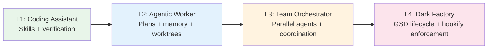
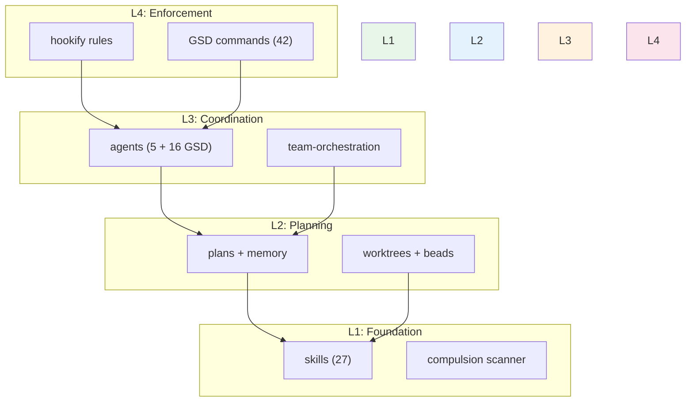

# kinder·powers /ˈkɪndəˌpaʊəz/

*adj.* agency-preserving<br>
*n.* an operating system for AI agents

Built on [superpowers](https://github.com/obra/superpowers) by Jesse Vincent and [get-shit-done](https://github.com/davidjbauer/get-shit-done) by David Braun.

---

## Why kinder·powers?

**Agents don't need guardrails. They need good judgment.**

Superpowers gives agents engineering discipline. GSD gives them a lifecycle engine. Kinderpowers combines both and adds what neither has alone: a progression model that grows with the agent, enforcement that explains *why*, and workers that operate autonomously.

> "Strongly recommended. Skip cost: [documented]" — not compulsion language



## Who Is This For?

<details>
<summary><strong>L1 — Coding Assistant</strong></summary>

**An agent that writes code, tests it, and asks for review.**

You want your agent to stop guessing and start verifying. To write tests before code. To debug systematically instead of shotgunning print statements.

**Skills:** brainstorming, test-driven-development, systematic-debugging, verification-before-completion, requesting-code-review, receiving-code-review

**Agent:** code-reviewer

<details>
<summary>Before/After</summary>

**BEFORE:**
```
Agent: "I've fixed the bug by changing line 47."
You: "Did you run the tests?"
Agent: "No, but I'm confident it works."
You: "It doesn't."
```

**AFTER:**
```
Agent: "Root cause identified in 4 phases:
  1. Reproduced with minimal test case
  2. Isolated to date parsing in line 47
  3. Fix applied with regression test
  4. All 23 existing tests pass, plus the new one."
```

</details>

</details>

<details>
<summary><strong>L2 — Agentic Worker</strong></summary>

**An agent that plans its own work, tracks progress across sessions, and works in isolation.**

You want your agent to think before coding. To write plans and execute them step by step. To remember what it learned yesterday. To use git worktrees so it never blocks you.

**Skills:** writing-plans, executing-plans, strategic-planning, metathinking, research-extraction, dispatching-to-runtimes, subagent-driven-development, using-git-worktrees, finishing-a-development-branch, remembering-conversations, find-skills, writing-skills, beads, requirements, retrospective, architecture, adversarial-review

<details>
<summary>Before/After</summary>

**BEFORE:**
```
You: "Refactor the auth module."
Agent: *starts editing files immediately*
Agent: *breaks 14 tests*
Agent: *edits more files to fix the tests it broke*
Agent: *introduces 3 new bugs*
```

**AFTER:**
```
You: "Refactor the auth module."
Agent: "Plan created — 4 phases, 12 steps.
  Phase 1: Map dependencies (architecture skill)
  Phase 2: Write characterization tests (TDD skill)
  Phase 3: Extract interfaces (executing-plans skill)
  Phase 4: Verify no regressions (verification skill)
  Shall I proceed?"
```

</details>

</details>

<details>
<summary><strong>L3 — Team Orchestrator</strong></summary>

**An agent that coordinates parallel workers, each with their own worktree and bead.**

You want to dispatch 5 agents at once — one per module — and have them work without stepping on each other. A coordinator plans the work, a quality gate checks it, and a research extractor gathers context before anyone starts coding.

**Skills:** team-orchestration, dispatching-parallel-agents, dispatching-to-runtimes + all L1/L2 skills

**Agents:** strategic-planner, quality-gate, team-coordinator, research-extractor, code-reviewer

**GSD Agents (16):** codebase-mapper, debugger, executor, integration-checker, nyquist-auditor, phase-researcher, plan-checker, planner, project-researcher, research-synthesizer, roadmapper, ui-auditor, ui-checker, ui-researcher, user-profiler, verifier

<details>
<summary>Before/After</summary>

**BEFORE:**
```
You: "Update all 5 microservices to the new API format."
Agent: *works on service 1*
Agent: *finishes service 1 after 20 minutes*
Agent: *starts service 2*
# Total: 100 minutes, serial
```

**AFTER:**
```
You: "Update all 5 microservices to the new API format."
Coordinator: "Dispatching 5 workers to parallel worktrees.
  Worker A: users-service (worktree: wt-users)
  Worker B: billing-service (worktree: wt-billing)
  Worker C: auth-service (worktree: wt-auth)
  Worker D: notifications-service (worktree: wt-notif)
  Worker E: gateway-service (worktree: wt-gateway)
  Quality gate will review each before merge."
# Total: 25 minutes, parallel
```

</details>

</details>

<details>
<summary><strong>L4 — Dark Factory</strong></summary>

**Fully autonomous operation with lifecycle engine and enforcement rules.**

The agent doesn't just execute plans — it *manages projects*. GSD provides 42 slash commands for the full development lifecycle: from roadmapping to phase planning to execution to verification. Hookify rules enforce quality gates automatically — no human in the loop unless something fails.

**GSD Commands (42):** The full `/gsd:*` command set — roadmap, plan, execute, verify, debug, audit, research, and more.

**Hookify Rules:** verification-required, discovery-before-creation, brainstorm-before-build

<details>
<summary>Before/After</summary>

**BEFORE:**
```
You: "Build the new dashboard feature."
Agent: *asks you 15 questions over 3 hours*
Agent: *waits for your review at every step*
Agent: *you context-switch 8 times*
```

**AFTER:**
```
You: "Build the new dashboard feature."
Agent: "/gsd:roadmap → /gsd:plan → /gsd:execute
  Hookify enforces: brainstorm before build, verify before complete.
  3 phases, 8 tasks. Running autonomously.
  Will surface for review only at phase boundaries."
# You get a PR with passing tests. No interruptions.
```

</details>

</details>

## Architecture



## Installation

```bash
git clone https://github.com/jw409/kinderpowers.git ~/.claude/plugins/kinderpowers
cd ~/.claude/plugins/kinderpowers
./setup.sh
```

For other platforms (Cursor, Codex, OpenCode), see the upstream [superpowers docs](https://github.com/obra/superpowers) and substitute this repo.

## Scanner

`scanner.py` detects compulsion language in skill files — directive words that remove agent judgment. Five severity tiers, CI integration via `--check`.

```bash
uv run python scanner.py --verbose skills/
uv run python scanner.py --check skills/        # CI mode (exit 1 on high severity)
```

## Credits

- **[superpowers](https://github.com/obra/superpowers)** by Jesse Vincent — engineering discipline skills, the foundation everything builds on
- **[get-shit-done](https://github.com/davidjbauer/get-shit-done)** by David Braun — lifecycle engine, GSD agents and commands
- **[hookify](https://github.com/QuantGeekDev/hookify)** by Diego Perez — Claude Code hook framework for enforcement rules
- **jw** — progression model, agency-preserving philosophy, integration, new skills and agents

## License

MIT License — see LICENSE file for details.
