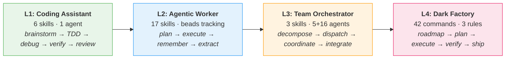
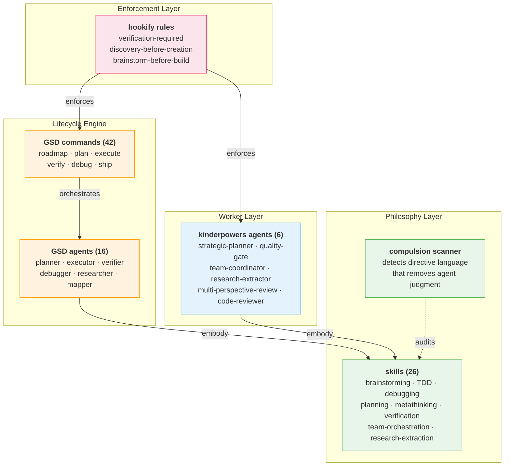

# kinder·powers /ˈkɪndəˌpaʊəz/

*adj.* agency-preserving<br>
*n.* an operating system for AI agents — from coding assistant to dark factory

Built on [superpowers](https://github.com/obra/superpowers) by Jesse Vincent and [get-shit-done](https://github.com/davidjbauer/get-shit-done) by Davíd Braun.

---

## Why kinder·powers?

**Agents don't need guardrails. They need good judgment.**

Most agent skill systems tell agents what they can't do. Kinderpowers tells them *how to think* — then trusts them to decide. Every recommendation documents the cost of skipping it, so agents can make informed trade-offs instead of blindly obeying.

Superpowers gives agents engineering discipline. GSD gives them a lifecycle engine. Kinderpowers combines both and adds what neither has alone: a progression model that grows with the agent, enforcement that explains *why*, and workers that operate autonomously.

> "Strongly recommended. Skip cost: [documented]" — not compulsion language



---

## Quick Start (Easy Mode)

```bash
# Install (once)
git clone https://github.com/jw409/kinderpowers.git ~/.claude/plugins/kinderpowers
cd ~/.claude/plugins/kinderpowers && ./setup.sh
```

**That's it.** Skills auto-inject via hooks — you don't invoke them. Write a test → TDD skill activates. Claim "done" → verification skill asks for evidence. Touch a plan file → executing-plans skill loads. You just work normally and the skills show up when relevant.

When you want the lifecycle engine:

```
/gsd:quick "add input validation to the signup form"
```

One command. GSD handles research, planning, execution, and verification. Atomic commits. Tests included. No ceremony.

When you want full autonomy:

```
/gsd:autonomous
```

Roadmap → plan → execute → verify → ship. For each phase. You review at phase boundaries. The agent manages everything else.

**You don't need to know 26 skills, 22 agents, or 42 commands.** They're auto-routed. The sections below are for power users who want to understand the machinery — or pick specific skills for specific situations.

---

## Who Is This For?

<details>
<summary><b>L1 — Coding Assistant</b> — "Claude helps me write better code"</summary>

**You want an agent that stops guessing and starts verifying.**

Your agent says "I've fixed the bug" without running the tests. It skips straight to code when you need a design conversation first. It shotguns `console.log` instead of isolating the root cause. It claims "looks correct" instead of showing you the passing test output.

Kinderpowers L1 gives your agent engineering discipline: brainstorm before building, test before claiming, debug systematically, verify with evidence.

**Skills:** brainstorming, test-driven-development, systematic-debugging, verification-before-completion, requesting-code-review, receiving-code-review

**Agent:** code-reviewer (read-only — can't modify code, only review it)

<details>
<summary>Before / After</summary>

**BEFORE:**
```
You:   "Fix the date parsing bug in user-profile.ts"
Agent: "I've updated line 47 to use Date.parse() instead."
You:   "Did you run the tests?"
Agent: "The logic looks correct."
You:   *runs tests* — 3 failures, the "fix" broke timezone handling
```

**AFTER:**
```
You:   "Fix the date parsing bug in user-profile.ts"

Agent: "I'm using the systematic-debugging skill.

  1. Reproduced: test_parse_iso_date fails with '2024-03-15T10:00:00Z'
  2. Root cause: Date.parse() returns local time, not UTC
  3. Fix: new Date(str).toISOString() preserves timezone
  4. Regression test added: test_timezone_preservation
  5. Ran full suite: 24/24 pass (including new test)

  Evidence:
  $ npm test -- --grep 'date'
  PASS  src/__tests__/user-profile.test.ts
    ✓ test_parse_iso_date (3ms)
    ✓ test_timezone_preservation (2ms)  ← new
    ✓ test_null_date_handling (1ms)"
```

</details>

</details>

<details>
<summary><b>L2 — Agentic Worker</b> — "Claude runs multi-step plans across sessions"</summary>

**You want an agent that thinks before coding, remembers across sessions, and works in isolation.**

Your agent starts editing files the moment you say "refactor." It breaks 14 tests, then introduces 3 new bugs fixing them. It doesn't remember the approach you agreed on yesterday. It works on `main` and blocks your own development.

Kinderpowers L2 gives your agent a planning brain: strategic plans with discovery before creation, git worktrees for isolation, bead-based tracking across sessions, and conversation memory that persists through context compaction.

**Skills:** writing-plans, executing-plans, strategic-planning, metathinking, research-extraction, dispatching-to-runtimes, subagent-driven-development, using-git-worktrees, finishing-a-development-branch, remembering-conversations, find-skills, writing-skills, beads, requirements, retrospective, architecture, adversarial-review

<details>
<summary>Before / After</summary>

**BEFORE:**
```
You:    "Refactor the auth module to use JWT instead of sessions."
Agent:  *immediately starts editing src/auth/session.ts*
Agent:  *breaks 14 tests*
Agent:  *edits 6 more files trying to fix what it broke*
Agent:  *introduces a security hole in token validation*
You:    "Stop. What was your plan?"
Agent:  "I was going to... update the auth module."
```

**AFTER:**
```
You:    "Refactor the auth module to use JWT instead of sessions."

Agent:  "I'm using the strategic-planning skill.

  Discovery: Found 3 files touching auth (session.ts, middleware.ts, types.ts).
  Found: existing token validation in src/utils/crypto.ts — will extend, not duplicate.

  Plan:
  Phase 1: Characterization tests for current session behavior (TDD skill)
  Phase 2: JWT token generation/validation extending crypto.ts
  Phase 3: Migrate middleware from session lookup to token verification
  Phase 4: Remove session store, verify all 47 tests pass

  Created worktree: wt-jwt-migration (won't touch your main branch)
  Tracked as: bead-a3f2 'Auth: JWT migration'

  Start Phase 1?"
```

</details>

</details>

<details>
<summary><b>L3 — Team Orchestrator</b> — "I coordinate agent teams in parallel"</summary>

**You want to dispatch 5 agents at once and have them work without stepping on each other.**

One agent takes 20 minutes per module. Five modules = 100 minutes serial. But if you just spawn 5 agents on the same codebase, they edit the same files, produce merge conflicts, and half the work gets thrown away.

Kinderpowers L3 gives you structured parallel execution: non-overlapping file domains, one task per worker, complete context injected upfront (no mid-task questions), and a quality gate that refuses to pass without evidence. Plus multi-perspective review that spawns disposable lenses (security, UX, resilience) selected based on what could break — not a fixed persona roster.

**Skills:** team-orchestration, dispatching-parallel-agents, dispatching-to-runtimes + all L1/L2 skills

**Agents:** strategic-planner, quality-gate, team-coordinator, research-extractor, multi-perspective-review, code-reviewer

**GSD Agents (16):** codebase-mapper, debugger, executor, integration-checker, nyquist-auditor, phase-researcher, plan-checker, planner, project-researcher, research-synthesizer, roadmapper, ui-auditor, ui-checker, ui-researcher, user-profiler, verifier

<details>
<summary>Before / After</summary>

**BEFORE:**
```
You:    "Update all 5 microservices to the new API v3 format."
Agent:  *works on users-service for 20 minutes*
Agent:  *finishes, starts billing-service*
Agent:  *20 more minutes*
# ... 100 minutes total, serial execution

# Or worse: spawn 5 agents without coordination
Worker A: edits shared/types.ts
Worker B: also edits shared/types.ts
# Result: merge conflict, 40 minutes wasted
```

**AFTER:**
```
You:    "Update all 5 microservices to the new API v3 format."

Coordinator: "I'm using the team-orchestration skill.

  Decomposed: 5 independent modules, no shared files.
  File domains mapped — zero overlap.

  Spawning 5 workers (haiku — deterministic schema update):
    worker-users:     src/users/**      (worktree: wt-users)
    worker-billing:   src/billing/**    (worktree: wt-billing)
    worker-auth:      src/auth/**       (worktree: wt-auth)
    worker-notif:     src/notif/**      (worktree: wt-notif)
    worker-gateway:   src/gateway/**    (worktree: wt-gateway)

  Each worker gets: API v3 schema, migration example, test command.
  Quality gate reviews each before merge."

# 5 workers finish in ~20 minutes. Quality gate verifies.
# Total: 25 minutes. Zero conflicts.
```

</details>

<details>
<summary>Multi-Perspective Review (Council Mode)</summary>

Instead of one reviewer catching one type of bug, spawn disposable lenses based on what could break:

```
Reviewing: New payment API endpoint

Lenses selected (based on risk profile):
  EDGE CASE  — "What happens with $0.00? Negative amounts? Currency overflow?"
  CONTRACT   — "Does it actually return the documented error codes?"
  RESILIENCE — "What if Stripe is down? What if the webhook times out?"

Results:
  CONSENSUS (2+ lenses agree):
    Missing: no idempotency key → duplicate charges on retry
  UNIQUE:
    EDGE CASE: $0.00 passes validation but Stripe rejects it (400)
    RESILIENCE: no circuit breaker — Stripe outage cascades to all requests

Verdict: 2 blocking issues before merge.
```

Six available lenses: WORKFLOW, EDGE CASE, RESILIENCE, CONTRACT, DOCUMENTATION, EMPATHY. Pick 2-3 based on the artifact, not all 6.

</details>

</details>

<details>
<summary><b>L4 — Dark Factory</b> — "Fully autonomous project delivery"</summary>

**The agent doesn't just execute plans — it manages projects.**

You describe a feature. The agent roadmaps it, breaks it into phases, researches each phase, creates detailed plans, executes with atomic commits, verifies against requirements, and ships a PR. You review at phase boundaries, not every line.

GSD provides 42 slash commands for the full development lifecycle. Hookify rules enforce quality gates automatically — the agent can't claim "done" without verification evidence, can't create new files without searching for existing ones first, and can't write 100+ lines without design discussion.

**GSD Commands (42):** `/gsd:new-project`, `/gsd:plan-phase`, `/gsd:execute-phase`, `/gsd:verify-work`, `/gsd:debug`, `/gsd:quick`, `/gsd:autonomous`, `/gsd:ship`, and 34 more.

**Hookify Rules (ship disabled — you opt in):**

| Rule | Trigger | Action | Philosophy |
|------|---------|--------|------------|
| verification-required | Agent claims "done" | Block | Evidence before assertions |
| discovery-before-creation | Agent creates new file | Warn | Search before you build |
| brainstorm-before-build | Agent writes 100+ lines | Warn | Think before you type |

<details>
<summary>Before / After</summary>

**BEFORE:**
```
You:    "Build a user settings page with profile editing and notification preferences."
Agent:  "What framework?"
You:    "Next.js with shadcn."
Agent:  "What fields?"
You:    "Name, email, avatar, notification toggles."
Agent:  "Should I use server actions?"
You:    "Yes."
Agent:  "What about validation?"
# ... 15 questions over 3 hours, 8 context switches for you
```

**AFTER:**
```
You:    "Build a user settings page with profile editing and notification preferences."

Agent:  "/gsd:new-project → context gathered, PROJECT.md created
        /gsd:plan-phase 1 → 'Settings UI with form validation'
          Researched: found existing form patterns in src/components/
          Plan: 6 tasks, TDD, extends existing FormField component
        /gsd:execute-phase 1 → running...
          [hookify] brainstorm-before-build: design discussion detected ✓
          [hookify] verification-required: 12/12 tests pass ✓
        /gsd:ship → PR #47 created with passing tests

        Phase 1 complete. PR ready for review.
        Phase 2 (notification preferences) planned. Proceed?"

# You review one PR. Not 15 questions.
```

</details>

</details>

---

## What's Inside (You Don't Need to Read This)

Everything below is auto-routed. Skills inject when relevant files are touched. GSD commands pick the right agents. You're reading the engine manual, not the driving instructions.

<details>
<summary><b>26 Skills</b> — auto-injected, you never invoke these manually</summary>

| Skill | Level | When It Activates |
|-------|-------|-------------------|
| brainstorming | L1 | Before any creative work — features, components, behavior changes |
| test-driven-development | L1 | Implementing any feature or bugfix |
| systematic-debugging | L1 | Any bug, test failure, or unexpected behavior |
| verification-before-completion | L1 | About to claim work is complete |
| requesting-code-review | L1 | Completing tasks, before merging |
| receiving-code-review | L1 | Receiving review feedback |
| writing-plans | L2 | Spec or requirements for a multi-step task |
| executing-plans | L2 | Written plan ready to execute |
| strategic-planning | L2 | Work needs design or discovery before execution |
| metathinking | L2 | Complex decisions, debugging mysteries, architectural choices |
| research-extraction | L2 | Analyzing external codebases, libraries, or papers |
| subagent-driven-development | L2 | Executing plans with independent tasks in current session |
| using-git-worktrees | L2 | Starting feature work that needs isolation |
| finishing-a-development-branch | L2 | Implementation complete, tests pass, ready to integrate |
| remembering-conversations | L2 | Unfamiliar workflows, past work references, "how should I..." |
| find-skills | L2 | Looking for functionality that might exist as a skill |
| writing-skills | L2 | Creating or editing skills |
| beads | L2 | Multi-session work, tracking dependencies, context recovery |
| requirements | L2 | Gathering requirements for a feature |
| retrospective | L2 | After completing a project or phase |
| architecture | L2 | System design decisions, ADRs |
| adversarial-review | L2 | Reviewing significant changes — assumes issues exist |
| team-orchestration | L3 | Coordinating multiple Claude Code agents in parallel |
| dispatching-parallel-agents | L3 | 2+ independent tasks with no shared state |
| dispatching-to-runtimes | L3 | Writing prompts for Gemini, GPT, or local models |

Skills are invitations, not commands. Every recommendation documents the cost of skipping it.

</details>

<details>
<summary><b>22 Agents</b> — spawned automatically by skills and GSD commands</summary>

**Kinderpowers Agents (6)**

| Agent | Model | Tools | Purpose |
|-------|-------|-------|---------|
| code-reviewer | inherit | Read, Grep, Glob, Bash | Reviews work against plan and standards (read-only) |
| strategic-planner | opus | Read, Grep, Glob, Bash, Write | Goal → discovery → phased plan |
| quality-gate | opus | Read, Grep, Glob, Bash | Adversarial verification — refuses without evidence (read-only) |
| team-coordinator | opus | Read, Grep, Glob, Bash, Agent, Write, Edit | Orchestrates parallel Claude Code teams |
| research-extractor | opus | Read, Grep, Glob, Bash, WebSearch, WebFetch | Idea extraction / usage evaluation / deep integration |
| multi-perspective-review | opus | Read, Grep, Glob, Bash, Agent | Council mode — spawns disposable review lenses |

**GSD Agents (16)** — lifecycle automation

| Agent | Purpose |
|-------|---------|
| gsd-planner | Detailed phase plans with task breakdown |
| gsd-executor | Plan execution with atomic commits |
| gsd-verifier | Phase goal verification |
| gsd-debugger | Scientific method debugging with persistent state |
| gsd-phase-researcher | Phase implementation research |
| gsd-project-researcher | Domain ecosystem research |
| gsd-research-synthesizer | Research output synthesis |
| gsd-roadmapper | Project roadmap creation |
| gsd-codebase-mapper | Parallel codebase analysis |
| gsd-plan-checker | Plan quality validation before execution |
| gsd-integration-checker | Cross-phase E2E verification |
| gsd-nyquist-auditor | Test coverage gap filling |
| gsd-ui-researcher | UI design contract generation |
| gsd-ui-auditor | 6-pillar frontend audit |
| gsd-ui-checker | UI-SPEC validation |
| gsd-user-profiler | Developer behavioral profiling |

Tool restrictions are intentional: reviewers can't write code, planners can't spawn agents, extractors get web access. The `tools` frontmatter field controls what each agent can do.

</details>

<details>
<summary><b>42 GSD Commands</b> — or just use <code>/gsd:quick</code> and <code>/gsd:do</code></summary>

**Project Setup**
- `/gsd:new-project` — initialize with deep context gathering
- `/gsd:new-milestone` — start a new milestone cycle
- `/gsd:map-codebase` — parallel codebase analysis

**Planning**
- `/gsd:discuss-phase` — gather context through adaptive questioning
- `/gsd:research-phase` — research before planning
- `/gsd:plan-phase` — create PLAN.md with verification loop
- `/gsd:list-phase-assumptions` — surface Claude's assumptions before planning

**Execution**
- `/gsd:execute-phase` — wave-based parallel execution
- `/gsd:quick` — small task with GSD guarantees, skip optional agents
- `/gsd:autonomous` — run remaining phases without human in the loop
- `/gsd:debug` — systematic debugging with persistent state

**Verification & Shipping**
- `/gsd:verify-work` — conversational UAT
- `/gsd:validate-phase` — retroactive Nyquist validation
- `/gsd:audit-milestone` — audit completion against original intent
- `/gsd:ship` — create PR, run review, prepare for merge

**Navigation**
- `/gsd:progress` — check status, route to next action
- `/gsd:next` — auto-advance to next logical step
- `/gsd:stats` — project metrics and timeline
- `/gsd:help` — full command reference

**Utilities**: `/gsd:add-phase`, `/gsd:remove-phase`, `/gsd:insert-phase`, `/gsd:add-todo`, `/gsd:check-todos`, `/gsd:note`, `/gsd:pause-work`, `/gsd:resume-work`, `/gsd:cleanup`, `/gsd:complete-milestone`, `/gsd:session-report`, `/gsd:settings`, `/gsd:set-profile`, `/gsd:update`, `/gsd:do`, `/gsd:plan-milestone-gaps`, `/gsd:add-tests`, `/gsd:ui-phase`, `/gsd:ui-review`, `/gsd:reapply-patches`, `/gsd:profile-user`, `/gsd:join-discord`

</details>

<details>
<summary><b>3 Hookify Rules</b> — enforcement that explains why</summary>

All rules **ship disabled**. You opt in. That's the kinderpowers way.

**verification-required** (event: stop, action: block)
> Blocks the agent from claiming "done" unless the transcript contains evidence of verification — test output, curl responses, screenshots. The agent can't just say "looks correct." It has to prove it.

**discovery-before-creation** (event: write, action: warn)
> Warns before creating new files if there's no evidence of searching for existing solutions first. Because the #1 agent anti-pattern is building something that already exists.

**brainstorm-before-build** (event: write, action: warn)
> Warns before writing 100+ lines if there's no evidence of design discussion. Not every file needs a brainstorm — but a 200-line component without any discussion of approach is a red flag.

Enable with `hookify:configure` or copy from `hookify-rules/` to your hookify installation.

</details>

<details>
<summary><b>2 MCP Servers</b> — Rust-native, install independently, 7x-27x token savings</summary>

### kp-github-mcp — drop-in GitHub plugin replacement

The official Claude Code GitHub plugin returns raw API responses. Listing 5 issues burns ~7,700 tokens on avatar URLs, node IDs, empty arrays, and nested user objects nobody asked for. kp-github-mcp runs the same queries through a 5-stage compression pipeline and returns only what matters.

| Query | Official Plugin | kp-github (default) | kp-github (projected) |
|-------|----------------|--------------------|-----------------------|
| 5 open issues | ~7,700 tokens | ~1,100 tokens | ~280 tokens |
| **Reduction** | 1x | **7x** | **27x** |

```bash
# Install (requires Rust toolchain)
cd mcp-servers/github && cargo build --release
claude mcp add kp-github --transport stdio -- ./target/release/kp-github-mcp

# Then disable the official plugin in ~/.claude/settings.json:
# "github@claude-plugins-official": false
```

**63 tools** — full superset of the official plugin plus Actions, Labels, Compare, Release Create. Every read tool accepts `fields` (project columns) and `format` (json/table/text).

**How it works:**
1. **Strip** — remove avatar_url, node_id, reactions, 20+ waste fields
2. **Flatten** — `user: {login: "alice", id: 123, ...}` → `user: "alice"`
3. **Project** — keep only the fields you asked for
4. **Compact** — timestamps to "2h ago", URLs to "owner/repo#42", SHAs to 7 chars, base64 content decoded to plaintext
5. **Format** — auto-detect: tables for uniform lists, JSON-lines for mixed, pretty JSON for single objects

**Backend**: reqwest HTTP (0.5s) with gh CLI fallback. Rate limit warnings when < 100 requests remaining.

**Quality**: 484 unit tests, 23 live integration tests, 97% line coverage. 7.3MB binary.

### kp-sequential-thinking — structured reasoning with hints, not mandates

Rust MCP server for structured thinking. The server surfaces observations about your reasoning pattern. You decide what to act on. Notably better than Anthropic's default, but honest about when it helps and when it's overhead.

```bash
cd mcp-servers/sequential-thinking && cargo build --release
claude mcp add kp-sequential-thinking --transport stdio -- ./target/release/kp-sequential-thinking
```

**When sequential thinking actually helps:**
- **Multi-agent coordination** — externalized reasoning that other agents can review, merge, or continue. If a subagent explores a branch, the orchestrator can read what it concluded.
- **Debugging mysteries** — structured hypothesis tracking. When you're 8 thoughts deep and need to backtrack, the branch history tells you what was tried and why it was rejected.
- **Architectural decisions with real trade-offs** — branching explores alternatives in parallel. Merge synthesizes. The audit trail shows what was considered, not just what was chosen.
- **Learning pipeline input** — JSONL logs feed into scavenger/teacher pipelines. Over time, the system learns which reasoning patterns precede user acceptance vs correction.

**When it's just overhead:**
- Simple tasks. If you know the answer, just do it. Don't create a 6-thought chain to justify adding a dependency.
- Single-agent work with no coordination needs. Native extended thinking (ultrathink) gives raw reasoning depth without the structured output overhead.
- When the model is already confident and correct. Branching a 0.9-confidence answer to "explore alternatives" wastes tokens.

**What it adds over Anthropic's official server:**

| Feature | Anthropic default | kp-sequential-thinking |
|---------|-------------------|----------------------|
| Branching | No | Yes — branch_from, branch_id, branch merge |
| Confidence tracking | No | Yes — 0.0-1.0 per thought, Dunning-Kruger detection |
| Layers | No | Yes — 1=problem, 2=approach, 3=details |
| Exploration | No | Yes — explore_count, proposals |
| Branch merge | No | Yes — continuation_mode=merge, mergeSummary |
| Hints system | No | Yes — 6 non-prescriptive observation types |
| Per-model profiles | No | Yes — Claude, Gemini, DeepSeek, Grok, Llama/Nemotron |
| JSONL logging | No | Yes — for learning pipeline harvesting |

**Hints (observations, not mandates):** The server surfaces signals — `linear_chain`, `premature_confidence`, `low_confidence_pattern`, `merge_available`, `explore_available`, `layer_available`. These are info/suggestions/observations. A capable caller acts on them. A simple caller ignores them and still gets a better-than-default experience.

**Per-model profiles:** Different models think differently. Claude gets balanced exploration (4-5 alternatives). Gemini Flash gets wide exploration (5-7). DeepSeek goes deep (3 layers). Custom profiles via JSON file.

**Quality**: 106 tests (87 unit + 19 integration), 95.6% line coverage. 4.6MB binary.

### Install both at once

```bash
cd mcp-servers && ./install.sh
```

</details>

---

## Architecture



---

## Installation

```bash
git clone https://github.com/jw409/kinderpowers.git ~/.claude/plugins/kinderpowers
cd ~/.claude/plugins/kinderpowers
./setup.sh
```

`setup.sh` creates symlinks for GSD commands (`~/.claude/commands/gsd/`), GSD agents (`~/.claude/agents/gsd-*.md`), and the GSD runtime (`~/.claude/get-shit-done/`). Idempotent — safe to re-run. Installs hookify rules if hookify is present.

For other platforms (Cursor, Codex, OpenCode), see the upstream [superpowers docs](https://github.com/obra/superpowers) and substitute this repo.

## Scanner

`scanner.py` detects compulsion language in skill files — directive words that remove agent judgment. Five severity tiers, CI integration via `--check`.

```bash
uv run python scanner.py --verbose skills/
uv run python scanner.py --check skills/        # CI mode (exit 1 on high severity)
```

| Severity | Example | Why It's Flagged |
|----------|---------|-----------------|
| HIGH | Absolute directives with no escape | Removes all agent judgment |
| MEDIUM | "you MUST always" | Commands without escape hatch |
| LOW | "REQUIRED SUB-SKILL" | Directive but with implicit opt-out |

The kinderpowers way: "Strongly recommended. Skip cost: [what you lose]."

## Credits

- **[superpowers](https://github.com/obra/superpowers)** by Jesse Vincent — the craft philosophy, skill format, scanner, and hook system that started it all
- **[get-shit-done](https://github.com/davidjbauer/get-shit-done)** by Davíd Braun — the lifecycle engine, 42 commands, 16 agents, and workflow machinery
- **[hookify](https://github.com/QuantGeekDev/hookify)** by Diego Perez — the enforcement rule format and Claude Code hook framework
- **[jw409](https://github.com/jw409)** — progression model, agency-preserving philosophy, council mode, new skills and agents

## License

MIT License — see LICENSE file for details.
