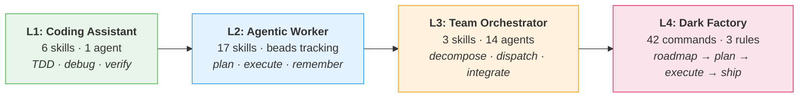

# kinder·powers

**Make your AI agent actually finish what it starts.**

Kinderpowers is a plugin for Claude Code that teaches agents engineering judgment — verify before claiming "done", branch when uncertain, run tests before committing, coordinate parallel workers without merge conflicts.

```bash
claude plugin marketplace add jw409/kinderpowers
claude plugin install kinderpowers
```

---

## The Progression Model

Most agent frameworks are flat. Kinderpowers grows with the agent.



**L1** — Your agent stops saying "looks correct" and starts showing you test output. Six skills auto-inject: brainstorming, TDD, systematic debugging, verification, code review (giving and receiving).

**L2** — Your agent plans before coding, remembers across sessions, and works in git worktrees so it never blocks your branch. Seventeen skills covering strategic planning, metathinking, research extraction, beads-based tracking, and more.

**L3** — Five modules to update? Spawn five workers with non-overlapping file domains. Twenty minutes, zero conflicts. Includes multi-perspective review that selects lenses (security, edge cases, resilience) based on what could actually break.

**L4** — Full lifecycle automation. You describe a feature; the agent roadmaps it, plans phases, executes with atomic commits, verifies against requirements, and ships a PR. You review at phase boundaries. Forty-two GSD commands, three hookify rules that ship disabled until you opt in.

---

## Before / After

**Without kinderpowers:**
```
You:   "Fix the date parsing bug"
Agent: "I've updated line 47 to use Date.parse()."
You:   "Did you run the tests?"
Agent: "The logic looks correct."
You:   *runs tests* — 3 failures, the "fix" broke timezone handling
```

**With kinderpowers:**
```
You:   "Fix the date parsing bug"
Agent: "Reproduced: test_parse_iso_date fails with '2024-03-15T10:00:00Z'
        Root cause: Date.parse() returns local time, not UTC
        Fix: new Date(str).toISOString() preserves timezone
        Regression test added: test_timezone_preservation
        Full suite: 24/24 pass

        $ npm test -- --grep 'date'
        PASS  ✓ test_parse_iso_date (3ms)
             ✓ test_timezone_preservation (2ms)  ← new"
```

The agent didn't get smarter. It got disciplined. Skills auto-inject based on what you're doing — touch a test file and TDD activates, claim "done" and verification asks for evidence.

---

## MCP Servers

Two Rust-native MCP servers, shipped with pre-built binaries (linux-x86_64, macOS-arm64). No Rust toolchain required.

### kp-github — 7x fewer tokens than the official plugin

The official Claude Code GitHub plugin returns raw API responses. Listing 5 issues burns ~7,700 tokens on avatar URLs, node IDs, and empty arrays. kp-github runs a 5-stage compression pipeline and returns ~1,100 tokens for the same query.

63 tools. Full superset of the official plugin plus Actions, Labels, Compare, and Release Create. Every read tool accepts `fields` and `format` parameters.

484 unit tests, 23 integration tests, 97% coverage. 7.3MB binary.

### kp-sequential-thinking — structured reasoning with hints

Branching, confidence tracking (with Dunning-Kruger detection), abstraction layers, exploration mode, branch merging, per-model profiles (Claude, Gemini, DeepSeek, Grok, Llama/Nemotron), and JSONL logging for learning pipelines.

Six hint types surface observations about reasoning patterns. The agent decides what to act on.

106 tests, 95.6% coverage. 4.6MB binary.

```bash
# Install both
cd mcp-servers && ./install.sh
```

---

## Who Is This For

**Solo developers** using Claude Code who are tired of agents that guess instead of verify.

**Team leads** coordinating parallel agent workers on shared codebases.

**Store owners** building on Unified Commerce Platform (UCP) — kinderpowers + UCP gives your agent the discipline to handle payment flows, inventory sync, and multi-channel operations without cutting corners.

**Anyone building with agents** who wants a progression model instead of a flat skill dump.

---

## What's Inside

Everything auto-routes. You don't need to memorize this.

| Layer | Count | Details |
|-------|-------|---------|
| Skills | 27 | Auto-injected when relevant files are touched ([manifest](skills/)) |
| Agents | 14 | 6 kinderpowers + 8 GSD, spawned by skills and commands ([agents](agents/)) |
| GSD Commands | 42 | Full lifecycle — or just `/gsd:quick` and `/gsd:autonomous` |
| Hookify Rules | 3 | Ship disabled. Verification-required, discovery-before-creation, brainstorm-before-build |
| MCP Servers | 2 | kp-github (63 tools), kp-sequential-thinking |

The philosophy: skills are invitations, not commands. Every recommendation documents the cost of skipping it, so agents make informed trade-offs instead of blindly obeying.

### Enforcement Rules

All rules ship disabled. You opt in.

- **verification-required** — blocks "done" claims without evidence (test output, curl responses, screenshots)
- **discovery-before-creation** — warns before creating files without searching for existing solutions
- **brainstorm-before-build** — warns before writing 100+ lines without design discussion

### Scanner

`scanner.py` detects compulsion language in skill files — directive words that remove agent judgment. Five severity tiers, CI integration via `--check`.

```bash
uv run python scanner.py --check skills/
```

---

## Installation

```bash
claude plugin marketplace add jw409/kinderpowers
claude plugin install kinderpowers
```

For manual installation or other platforms (Cursor, Codex, OpenCode):

```bash
git clone https://github.com/jw409/kinderpowers.git ~/.claude/plugins/kinderpowers
cd ~/.claude/plugins/kinderpowers && ./setup.sh
```

`setup.sh` creates the GSD runtime symlink, installs hookify rules if present, and sets up the agent-outcome-logger hook. Idempotent. GSD commands and agents register automatically via the plugin system.

---

## Credits

- **[superpowers](https://github.com/obra/superpowers)** by Jesse Vincent — craft philosophy, skill format, scanner, hook system
- **[get-shit-done](https://github.com/davidjbauer/get-shit-done)** by David Braun — lifecycle engine, 42 commands, 8 parameterized agents
- **[hookify](https://github.com/QuantGeekDev/hookify)** by Diego Perez — enforcement rule format, Claude Code hook framework
- **[jw409](https://github.com/jw409)** — progression model, agency-preserving philosophy, council mode, MCP servers

## License

MIT — see LICENSE.

---

```bash
claude plugin marketplace add jw409/kinderpowers
claude plugin install kinderpowers
```
