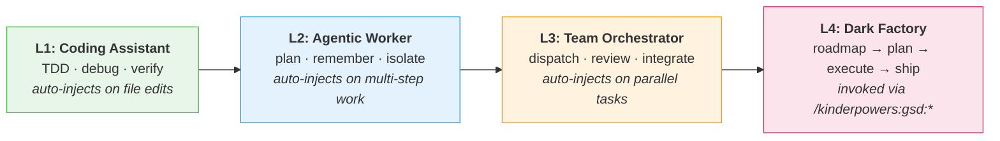

# kinder·powers /ˈkɪndərˌpaʊərz/

*n.* agency-preserving discipline for AI agents — skills as signposts, not walls.<br>
*v.* to teach an agent to verify before claiming "done", branch when uncertain, and ask before deleting.

---

## How you actually use this

You type two things to install, then you just work. The rest is automatic.

```bash
claude plugin marketplace add jw409/kinderpowers
claude plugin install kinderpowers
```

On your next session start, Claude Code injects the `using-kinderpowers` orientation skill into context. From that point on, the agent surfaces relevant skills (via the `Skill` tool) based on what you're actually doing — you don't name them by hand. Write a failing test, `test-driven-development` loads. Start debugging, `systematic-debugging` loads. Claim work is done, `verification-before-completion` loads and asks for the test output.

That's the entry surface. Everything below is reference.

<details>
<summary><strong>Optional slash commands</strong> — invoke when you want the lifecycle engine, not just the skills</summary>

```
/kinderpowers:gsd:quick "<task>"        # one task, atomic commits, no ceremony
/kinderpowers:gsd:new-project           # initialize from scratch with discovery
/kinderpowers:gsd:autonomous            # run remaining phases end-to-end
/kinderpowers:gsd:next                  # auto-route to the next logical step
/kinderpowers:gsd:help                  # full GSD command landscape
```

These come from the bundled **get-shit-done** lifecycle engine. Use them when you want structured phases (roadmap → plan → execute → ship) rather than ad-hoc skill invocations.

</details>

<details>
<summary><strong>Optional enforcement (opt-in, not default)</strong> — turn skill recommendations into hard gates</summary>

After install, clone this repo and run `./setup.sh` to install three hookify rules as strict enforcement:

- **verification-required** — blocks "done" claims without evidence in the transcript
- **discovery-before-creation** — warns before creating files without search evidence
- **brainstorm-before-build** — warns before writing 100+ lines without design discussion

Rules ship disabled. setup.sh symlinks them into `~/.claude/hookify/rules/` where hookify can enable them. Without hookify, skills remain recommendations.

</details>

---

## Signposts, not walls

The philosophy in one paragraph. A wall stops you at every intersection; a signpost names the hazard and adds the distance of the detour, then yields to your judgment. Every kinderpowers skill is a signpost — it documents the cost of skipping and hands control back to you. Agents guided by walls become brittle and learn to evade. Agents guided by signposts stay accountable because they keep their agency.

The scanner (`scanner.py`) enforces this mechanically: compulsion language (`MUST`, `NEVER`, `NOT NEGOTIABLE` without documented exceptions) is flagged on every skill edit. Strong recommendations — which are fine — carry a `Skip cost:` line that names what you lose.

---

## The progression model

Kinderpowers grows with the agent. You don't learn more commands; more of the system kicks in automatically as your work gets bigger.



<details>
<summary>🧑‍💻 <strong>L1 — Solo dev fixing a bug</strong></summary>

You edit a test file. `test-driven-development` surfaces. You claim the fix is done. `verification-before-completion` asks for test output.

**Without kinderpowers:**
```
You:   "Fix the date parsing bug"
Agent: "I've updated line 47 to use Date.parse()."
You:   "Did you run the tests?"
Agent: "The logic looks correct."
You:   *runs tests* — 3 failures, timezone handling broke
```

**With kinderpowers:**
```
You:   "Fix the date parsing bug"
Agent: Reproduced: test_parse_iso_date fails with '2024-03-15T10:00:00Z'
       Root cause: Date.parse() returns local time, not UTC
       Fix: new Date(str).toISOString() preserves timezone
       $ npm test -- --grep 'date'
       PASS  ✓ test_parse_iso_date (3ms)
             ✓ test_timezone_preservation (2ms)  ← new
```

The agent didn't get smarter. It got disciplined.

</details>

<details>
<summary>🛠️ <strong>L2 — Feature spanning multiple sessions</strong></summary>

You start a feature Friday, context compacts, you resume Monday. `remembering-conversations` surfaces on resume. `beads` keeps the work graph alive across sessions. `using-git-worktrees` isolates your in-flight branch so the main tree is safe.

**Without kinderpowers:**
```
Mon: "Where was I on the refactor?"
Agent: *reads three files, guesses*
```

**With kinderpowers:**
```
Mon: "Where was I on the refactor?"
Agent: Beads shows 3 of 7 tasks done. Blocker on task 4 (awaiting
       auth decision from you). Worktree at .worktrees/auth-refactor
       is clean. Main branch unchanged. Ready to continue at task 5
       once blocker resolves.
```

</details>

<details>
<summary>🧑‍🏫 <strong>L3 — Refactor across five modules</strong></summary>

You ask for a parallel refactor. `dispatching-parallel-agents` loads. `team-orchestration` partitions the work into non-overlapping file domains. `multi-perspective-review` spawns lens agents (Edge Case, Contract, Resilience) to review the merged result.

The agent spawns five workers with bounded scopes, collects results, and runs council-mode review before claiming done. You review once at the integration boundary.

</details>

<details>
<summary>🏭 <strong>L4 — Ship a feature end-to-end</strong></summary>

```bash
/kinderpowers:gsd:new-project       # discovery, PROJECT.md, roadmap
/kinderpowers:gsd:plan-phase 01     # PLAN.md with verification loop
/kinderpowers:gsd:execute-phase 01  # atomic commits, checkpoints
/kinderpowers:gsd:ship              # PR, review, merge prep
```

Full lifecycle with atomic commits at every task boundary. You review at phase boundaries. Hookify rules (if enabled) refuse to let a phase close without verification evidence.

</details>

---

## MCP servers

Two Rust-native servers ship with the plugin. Pre-built binaries for Linux x86_64 and macOS arm64 — no Rust toolchain required on install.

<details>
<summary><strong>kp-github</strong> — ~7× fewer tokens than the official GitHub plugin</summary>

The official Claude Code GitHub plugin returns raw API responses. Listing 5 issues burns ~7,700 tokens on avatar URLs, node IDs, and empty arrays. kp-github runs a 5-stage compression pipeline and returns ~1,100 tokens for the same query.

Full superset of the official plugin plus Actions, Labels, Compare, and Release Create. Every read tool accepts `fields` and `format` parameters — you control exactly what comes back.

```
Issues    · list, get, create, comment, update, search, labels, sub-issues
PRs       · list, get, diff, files, checks, review, merge, comment threads
Actions   · workflow runs, logs, reruns
Branches  · list, create, compare
Releases  · list, latest, create
Repos     · get, search, fork
...
```

</details>

<details>
<summary><strong>kp-sequential-thinking</strong> — structured reasoning with hints, not mandates</summary>

One tool (`sequentialthinking`), many modes. Branching, confidence tracking (with Dunning-Kruger detection), abstraction layers, exploration, branch merging, and per-model profiles (Claude, Gemini, DeepSeek, Grok, Llama/Nemotron).

Six hint types surface observations about reasoning patterns — `linear_chain`, `premature_confidence`, `merge_available`, etc. — and the agent decides whether to act. Hints are signposts, not walls.

Default model profile: `claude-opus-4-7`. JSONL logging optional for downstream learning pipelines.

</details>

---

## Credits

- **[superpowers](https://github.com/obra/superpowers)** by Jesse Vincent — craft philosophy, skill format, scanner, hook system
- **[get-shit-done](https://github.com/gsd-build/get-shit-done)** by TÂCHES — lifecycle engine, commands, agents, workflows
- **[hookify](https://github.com/QuantGeekDev/hookify)** by Diego Perez — enforcement rule format, Claude Code hook framework
- **[jw409](https://github.com/jw409)** — progression model, agency-preserving philosophy, council-mode review, MCP servers

## License

MIT — see LICENSE.

---

**Canonical manifest:** [KINDERPOWERS.xml](KINDERPOWERS.xml) — machine-readable catalog of skills, agents, commands, MCP servers, invariants, and references. Agents ingesting this repo should read that file, not this one.

```bash
claude plugin marketplace add jw409/kinderpowers
claude plugin install kinderpowers
```
