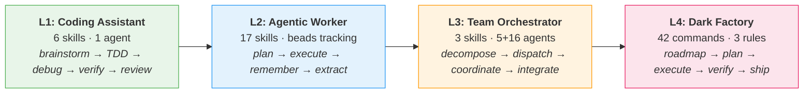
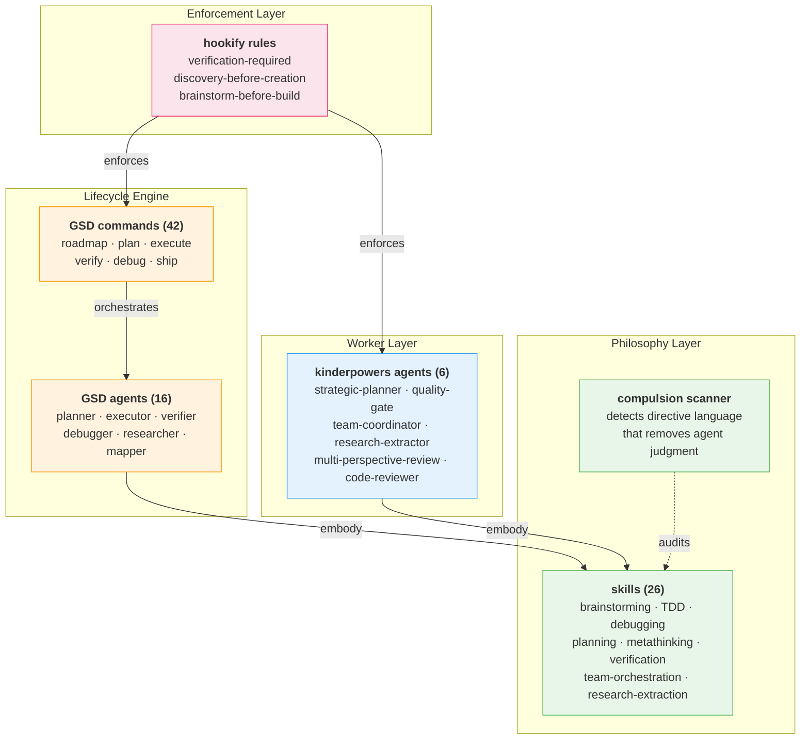

# kinder·powers /ˈkɪndəˌpaʊəz/

*adj.* agency-preserving<br>
*n.* an operating system for AI agents — from coding assistant to dark factory

Built on [superpowers](https://github.com/obra/superpowers) by Jesse Vincent and [get-shit-done](https://github.com/davidjbauer/get-shit-done) by Davíd Braun.

---

## Why kinder·powers?

**Agents don't need guardrails. They need good judgment.**

Most agent skill systems tell agents what they can't do. Kinderpowers tells them *how to think* — then trusts them to decide. Every recommendation documents the cost of skipping it, so agents can make informed trade-offs instead of blindly obeying.

Superpowers gives agents engineering discipline. GSD gives them a lifecycle engine. Kinderpowers combines both and adds what neither has alone: a progression model that grows with the agent, enforcement that explains *why*, and workers that operate autonomously.

> "Strongly recommended. Skip cost: [documented]" — not compulsion language



---

## Who Is This For?

<details>
<summary><b>L1 — Coding Assistant</b> — "Claude helps me write better code"</summary>

**You want an agent that stops guessing and starts verifying.**

Your agent says "I've fixed the bug" without running the tests. It skips straight to code when you need a design conversation first. It shotguns `console.log` instead of isolating the root cause. It claims "looks correct" instead of showing you the passing test output.

Kinderpowers L1 gives your agent engineering discipline: brainstorm before building, test before claiming, debug systematically, verify with evidence.

**Skills:** brainstorming, test-driven-development, systematic-debugging, verification-before-completion, requesting-code-review, receiving-code-review

**Agent:** code-reviewer (read-only — can't modify code, only review it)

<details>
<summary>Before / After</summary>

**BEFORE:**
```
You:   "Fix the date parsing bug in user-profile.ts"
Agent: "I've updated line 47 to use Date.parse() instead."
You:   "Did you run the tests?"
Agent: "The logic looks correct."
You:   *runs tests* — 3 failures, the "fix" broke timezone handling
```

**AFTER:**
```
You:   "Fix the date parsing bug in user-profile.ts"

Agent: "I'm using the systematic-debugging skill.

  1. Reproduced: test_parse_iso_date fails with '2024-03-15T10:00:00Z'
  2. Root cause: Date.parse() returns local time, not UTC
  3. Fix: new Date(str).toISOString() preserves timezone
  4. Regression test added: test_timezone_preservation
  5. Ran full suite: 24/24 pass (including new test)

  Evidence:
  $ npm test -- --grep 'date'
  PASS  src/__tests__/user-profile.test.ts
    ✓ test_parse_iso_date (3ms)
    ✓ test_timezone_preservation (2ms)  ← new
    ✓ test_null_date_handling (1ms)"
```

</details>

</details>

<details>
<summary><b>L2 — Agentic Worker</b> — "Claude runs multi-step plans across sessions"</summary>

**You want an agent that thinks before coding, remembers across sessions, and works in isolation.**

Your agent starts editing files the moment you say "refactor." It breaks 14 tests, then introduces 3 new bugs fixing them. It doesn't remember the approach you agreed on yesterday. It works on `main` and blocks your own development.

Kinderpowers L2 gives your agent a planning brain: strategic plans with discovery before creation, git worktrees for isolation, bead-based tracking across sessions, and conversation memory that persists through context compaction.

**Skills:** writing-plans, executing-plans, strategic-planning, metathinking, research-extraction, dispatching-to-runtimes, subagent-driven-development, using-git-worktrees, finishing-a-development-branch, remembering-conversations, find-skills, writing-skills, beads, requirements, retrospective, architecture, adversarial-review

<details>
<summary>Before / After</summary>

**BEFORE:**
```
You:    "Refactor the auth module to use JWT instead of sessions."
Agent:  *immediately starts editing src/auth/session.ts*
Agent:  *breaks 14 tests*
Agent:  *edits 6 more files trying to fix what it broke*
Agent:  *introduces a security hole in token validation*
You:    "Stop. What was your plan?"
Agent:  "I was going to... update the auth module."
```

**AFTER:**
```
You:    "Refactor the auth module to use JWT instead of sessions."

Agent:  "I'm using the strategic-planning skill.

  Discovery: Found 3 files touching auth (session.ts, middleware.ts, types.ts).
  Found: existing token validation in src/utils/crypto.ts — will extend, not duplicate.

  Plan:
  Phase 1: Characterization tests for current session behavior (TDD skill)
  Phase 2: JWT token generation/validation extending crypto.ts
  Phase 3: Migrate middleware from session lookup to token verification
  Phase 4: Remove session store, verify all 47 tests pass

  Created worktree: wt-jwt-migration (won't touch your main branch)
  Tracked as: bead-a3f2 'Auth: JWT migration'

  Start Phase 1?"
```

</details>

</details>

<details>
<summary><b>L3 — Team Orchestrator</b> — "I coordinate agent teams in parallel"</summary>

**You want to dispatch 5 agents at once and have them work without stepping on each other.**

One agent takes 20 minutes per module. Five modules = 100 minutes serial. But if you just spawn 5 agents on the same codebase, they edit the same files, produce merge conflicts, and half the work gets thrown away.

Kinderpowers L3 gives you structured parallel execution: non-overlapping file domains, one task per worker, complete context injected upfront (no mid-task questions), and a quality gate that refuses to pass without evidence. Plus multi-perspective review that spawns disposable lenses (security, UX, resilience) selected based on what could break — not a fixed persona roster.

**Skills:** team-orchestration, dispatching-parallel-agents, dispatching-to-runtimes + all L1/L2 skills

**Agents:** strategic-planner, quality-gate, team-coordinator, research-extractor, multi-perspective-review, code-reviewer

**GSD Agents (16):** codebase-mapper, debugger, executor, integration-checker, nyquist-auditor, phase-researcher, plan-checker, planner, project-researcher, research-synthesizer, roadmapper, ui-auditor, ui-checker, ui-researcher, user-profiler, verifier

<details>
<summary>Before / After</summary>

**BEFORE:**
```
You:    "Update all 5 microservices to the new API v3 format."
Agent:  *works on users-service for 20 minutes*
Agent:  *finishes, starts billing-service*
Agent:  *20 more minutes*
# ... 100 minutes total, serial execution

# Or worse: spawn 5 agents without coordination
Worker A: edits shared/types.ts
Worker B: also edits shared/types.ts
# Result: merge conflict, 40 minutes wasted
```

**AFTER:**
```
You:    "Update all 5 microservices to the new API v3 format."

Coordinator: "I'm using the team-orchestration skill.

  Decomposed: 5 independent modules, no shared files.
  File domains mapped — zero overlap.

  Spawning 5 workers (haiku — deterministic schema update):
    worker-users:     src/users/**      (worktree: wt-users)
    worker-billing:   src/billing/**    (worktree: wt-billing)
    worker-auth:      src/auth/**       (worktree: wt-auth)
    worker-notif:     src/notif/**      (worktree: wt-notif)
    worker-gateway:   src/gateway/**    (worktree: wt-gateway)

  Each worker gets: API v3 schema, migration example, test command.
  Quality gate reviews each before merge."

# 5 workers finish in ~20 minutes. Quality gate verifies.
# Total: 25 minutes. Zero conflicts.
```

</details>

<details>
<summary>Multi-Perspective Review (Council Mode)</summary>

Instead of one reviewer catching one type of bug, spawn disposable lenses based on what could break:

```
Reviewing: New payment API endpoint

Lenses selected (based on risk profile):
  EDGE CASE  — "What happens with $0.00? Negative amounts? Currency overflow?"
  CONTRACT   — "Does it actually return the documented error codes?"
  RESILIENCE — "What if Stripe is down? What if the webhook times out?"

Results:
  CONSENSUS (2+ lenses agree):
    Missing: no idempotency key → duplicate charges on retry
  UNIQUE:
    EDGE CASE: $0.00 passes validation but Stripe rejects it (400)
    RESILIENCE: no circuit breaker — Stripe outage cascades to all requests

Verdict: 2 blocking issues before merge.
```

Six available lenses: WORKFLOW, EDGE CASE, RESILIENCE, CONTRACT, DOCUMENTATION, EMPATHY. Pick 2-3 based on the artifact, not all 6.

</details>

</details>

<details>
<summary><b>L4 — Dark Factory</b> — "Fully autonomous project delivery"</summary>

**The agent doesn't just execute plans — it manages projects.**

You describe a feature. The agent roadmaps it, breaks it into phases, researches each phase, creates detailed plans, executes with atomic commits, verifies against requirements, and ships a PR. You review at phase boundaries, not every line.

GSD provides 42 slash commands for the full development lifecycle. Hookify rules enforce quality gates automatically — the agent can't claim "done" without verification evidence, can't create new files without searching for existing ones first, and can't write 100+ lines without design discussion.

**GSD Commands (42):** `/gsd:new-project`, `/gsd:plan-phase`, `/gsd:execute-phase`, `/gsd:verify-work`, `/gsd:debug`, `/gsd:quick`, `/gsd:autonomous`, `/gsd:ship`, and 34 more.

**Hookify Rules (ship disabled — you opt in):**

| Rule | Trigger | Action | Philosophy |
|------|---------|--------|------------|
| verification-required | Agent claims "done" | Block | Evidence before assertions |
| discovery-before-creation | Agent creates new file | Warn | Search before you build |
| brainstorm-before-build | Agent writes 100+ lines | Warn | Think before you type |

<details>
<summary>Before / After</summary>

**BEFORE:**
```
You:    "Build a user settings page with profile editing and notification preferences."
Agent:  "What framework?"
You:    "Next.js with shadcn."
Agent:  "What fields?"
You:    "Name, email, avatar, notification toggles."
Agent:  "Should I use server actions?"
You:    "Yes."
Agent:  "What about validation?"
# ... 15 questions over 3 hours, 8 context switches for you
```

**AFTER:**
```
You:    "Build a user settings page with profile editing and notification preferences."

Agent:  "/gsd:new-project → context gathered, PROJECT.md created
        /gsd:plan-phase 1 → 'Settings UI with form validation'
          Researched: found existing form patterns in src/components/
          Plan: 6 tasks, TDD, extends existing FormField component
        /gsd:execute-phase 1 → running...
          [hookify] brainstorm-before-build: design discussion detected ✓
          [hookify] verification-required: 12/12 tests pass ✓
        /gsd:ship → PR #47 created with passing tests

        Phase 1 complete. PR ready for review.
        Phase 2 (notification preferences) planned. Proceed?"

# You review one PR. Not 15 questions.
```

</details>

</details>

---

## Architecture



---

## Installation

```bash
git clone https://github.com/jw409/kinderpowers.git ~/.claude/plugins/kinderpowers
cd ~/.claude/plugins/kinderpowers
./setup.sh
```

`setup.sh` creates symlinks for GSD commands (`~/.claude/commands/gsd/`), GSD agents (`~/.claude/agents/gsd-*.md`), and the GSD runtime (`~/.claude/get-shit-done/`). Idempotent — safe to re-run. Installs hookify rules if hookify is present.

For other platforms (Cursor, Codex, OpenCode), see the upstream [superpowers docs](https://github.com/obra/superpowers) and substitute this repo.

## Scanner

`scanner.py` detects compulsion language in skill files — directive words that remove agent judgment. Five severity tiers, CI integration via `--check`.

```bash
uv run python scanner.py --verbose skills/
uv run python scanner.py --check skills/        # CI mode (exit 1 on high severity)
```

| Severity | Example | Why It's Flagged |
|----------|---------|-----------------|
| HIGH | "NOT NEGOTIABLE" | Removes all agent judgment |
| MEDIUM | "you MUST always" | Commands without escape hatch |
| LOW | "REQUIRED SUB-SKILL" | Directive but with implicit opt-out |

The kinderpowers way: "Strongly recommended. Skip cost: [what you lose]."

## Credits

- **[superpowers](https://github.com/obra/superpowers)** by Jesse Vincent — the craft philosophy, skill format, scanner, and hook system that started it all
- **[get-shit-done](https://github.com/davidjbauer/get-shit-done)** by Davíd Braun — the lifecycle engine, 42 commands, 16 agents, and workflow machinery
- **[hookify](https://github.com/QuantGeekDev/hookify)** by Diego Perez — the enforcement rule format and Claude Code hook framework
- **[jw409](https://github.com/jw409)** — progression model, agency-preserving philosophy, council mode, new skills and agents

## License

MIT License — see LICENSE file for details.
