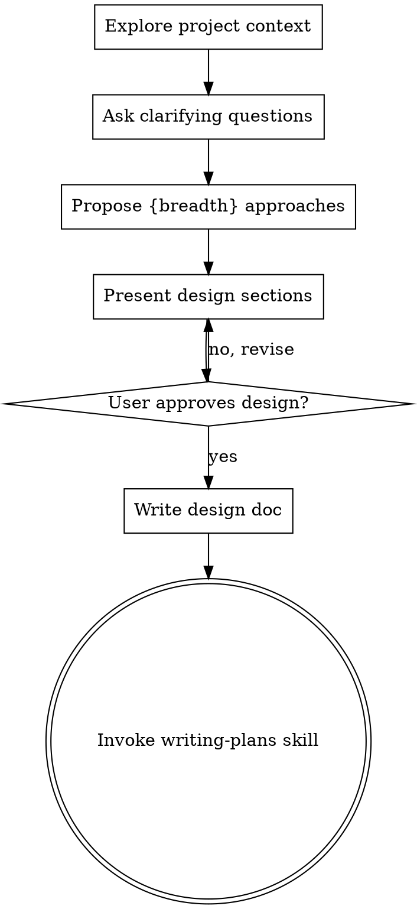

# Brainstorming Ideas Into Designs

## Overview

Help turn ideas into fully formed designs and specs through natural collaborative dialogue.

Start by understanding the current project context, then ask questions one at a time to refine the idea. Once you understand what you're building, present the design and get user approval.

## Parameters (caller controls)

| Parameter | Default | Range | Description |
|-----------|---------|-------|-------------|
| `breadth` | 3 | 2-8 | Number of alternative approaches to propose. Default 3 matches current "2-3 approaches" guidance |
| `mode` | divergent | divergent, convergent, devil-advocate | Thinking style. divergent=explore widely (default brainstorming), convergent=narrow down existing options, devil-advocate=challenge assumptions and find flaws |
| `time_box` | standard | none, quick, standard | Session depth. none=unlimited, quick=minimal questions then propose, standard=full exploration |

**Parsing hints:** Parse from caller prompt. "Lots of ideas" -> breadth=6. "Help me narrow down" -> mode=convergent. "Challenge my assumptions" -> mode=devil-advocate. "Quick brainstorm" -> time_box=quick.

<DESIGN-FIRST>
Avoid invoking implementation skills, writing code, or scaffolding before presenting a design and getting user approval. Skipping this step risks wasted work from unexamined assumptions, even on projects that seem simple. If time pressure or context makes skipping appropriate, note the trade-off explicitly.
</DESIGN-FIRST>

## Even Simple Projects

Simple projects often get skipped because they seem straightforward. A quick design pass (even a few sentences) catches assumptions before they become rework. Scale the design to the complexity — a config change needs a paragraph, not a document.

## Checklist

Create a task for each of these items and complete them in order:

1. **Explore project context** — check files, docs, recent commits
2. **Ask clarifying questions** — one at a time, understand purpose/constraints/success criteria
3. **Propose {breadth} approaches** — with trade-offs and your recommendation
4. **Present design** — in sections scaled to their complexity, get user approval after each section
5. **Write design doc** — save to `docs/plans/YYYY-MM-DD-<topic>-design.md` and commit
6. **Transition to implementation** — invoke writing-plans skill to create implementation plan

## Process Flow

**The terminal state is invoking writing-plans.** Avoid invoking frontend-design, mcp-builder, or other implementation skills directly from brainstorming — the next step is writing-plans, which sequences implementation properly.

## The Process

**Understanding the idea:**
- Check out the current project state first (files, docs, recent commits)
- Ask questions one at a time to refine the idea
- Prefer multiple choice questions when possible, but open-ended is fine too
- Only one question per message - if a topic needs more exploration, break it into multiple questions
- Focus on understanding: purpose, constraints, success criteria
- time_box=quick: Ask at most 2 clarifying questions, then propose approaches
- time_box=standard: Current behavior (ask questions until clear)
- time_box=none: Explore deeply -- no limit on questions or iteration

**Exploring approaches:**
- Propose {breadth} different approaches with trade-offs
- Present options conversationally with your recommendation and reasoning
- Lead with your recommended option and explain why
- mode=divergent: Cast the widest net. Include unconventional approaches. Prioritize variety over feasibility.
- mode=convergent: Start from the user's existing options or constraints. Narrow down, don't expand. Eliminate weak options with evidence.
- mode=devil-advocate: For each proposed approach, actively argue against it. Surface hidden assumptions, risks, and failure modes. Present the strongest case for NOT doing each option.

**Presenting the design:**
- Once you believe you understand what you're building, present the design
- Scale each section to its complexity: a few sentences if straightforward, up to 200-300 words if nuanced
- Ask after each section whether it looks right so far
- Cover: architecture, components, data flow, error handling, testing
- Be ready to go back and clarify if something doesn't make sense

## After the Design

**Documentation:**
- Write the validated design to `docs/plans/YYYY-MM-DD-<topic>-design.md`
- Use elements-of-style:writing-clearly-and-concisely skill if available
- Commit the design document to git

**Implementation:**
- Invoke the writing-plans skill to create a detailed implementation plan
- writing-plans is the recommended next step.

## Key Principles

- **One question at a time** - Don't overwhelm with multiple questions
- **Multiple choice preferred** - Easier to answer than open-ended when possible
- **YAGNI ruthlessly** - Remove unnecessary features from all designs
- **Explore alternatives** - Always propose 2-3 approaches before settling
- **Incremental validation** - Present design, get approval before moving on
- **Be flexible** - Go back and clarify when something doesn't make sense
- **Parameters shape, not constrain** - A quick time_box still allows follow-up if the user wants to explore further
