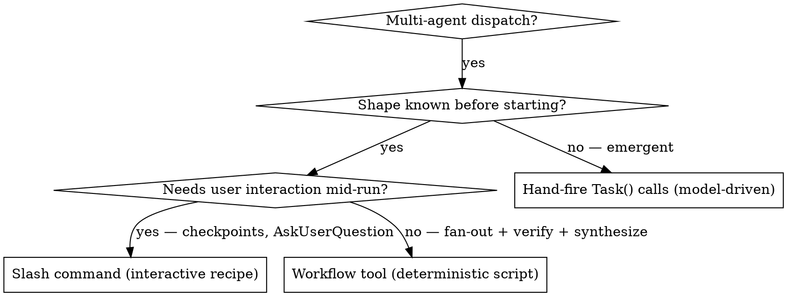

# Orchestration Primitives

## Overview

Claude Code has five orchestration primitives. They differ on two axes: **who decides the control flow** (the model, your code, or the harness) and **where the work runs** (your current context, a fresh context, or a background runtime). Picking the wrong one is the usual cause of fragile, model-judgment-driven parallelism that drops agents or forgets to verify.

**Core principle:** When the *shape* of the work is known before you start, encode it as code (the Workflow tool), not as model judgment re-enacted each run.

## Quick Reference

| Primitive | What it is | Control flow decided by | Runs in |
|-----------|-----------|-------------------------|---------|
| **Skill** | Markdown injected into *your* context; changes how *you* behave | The model (you read and follow) | Current conversation |
| **Subagent** (`Task`/`Agent`) | Fresh context + own tools; does a scoped job, returns its result | The model (you decide when to spawn) | New isolated context |
| **Slash command** | A saved prompt/recipe the main agent expands and follows | The model (LLM executes the steps) | Current conversation |
| **Hook** | Deterministic shell the harness runs at lifecycle events | Code/config (the harness) | Harness shell |
| **Workflow tool** | A deterministic **JS script** that fans out subagents via `agent()`/`parallel()`/`pipeline()` | **Code** (model writes once, runtime executes) | Background JS runtime |

One-line model: a **skill** changes *your* behavior in place; a **subagent** is a worker you hand a job; a **slash command** is a recipe *you* cook; a **Workflow** is a recipe written in *code* that a machine cooks.

## When to reach for the Workflow tool

**Workflow tool wins when** the dispatch is fixed and non-interactive: fan-out N reviewers, map a codebase with parallel agents, find→adversarially-verify→synthesize, loop-until-no-new-findings, judge panels. You get concurrency caps, token budgets, and resume-on-crash *for free* — guarantees the model cannot keep by hand.

**Stay model-driven (Task / slash command) when** the next step depends on what the last one found, the user must approve between steps, or you're exploring an unknown shape.

## Common Mistakes

- **Hand-firing parallel `Task()` calls for a fixed shape.** The model forgets to batch them, mis-analyzes dependencies, or drops an agent and never notices. If you can describe the fan-out in advance, it belongs in a Workflow script. See kinderpowers:dispatching-parallel-agents.
- **Trying to make an interactive flow a Workflow.** Workflows run in the background with no user prompts. Keep the interactive spine (GSD discuss/plan/execute) as slash commands; push only the non-interactive *leaves* (mapping, review fan-out, verification sweeps) into Workflows.
- **Confusing "slash command" with "Workflow."** A file under `gsd/workflows/*.md` is a slash-command recipe the model executes — not a `Workflow`-tool script. The Workflow tool means deterministic JS via `agent()`/`parallel()`/`pipeline()`.
- **Writing a hook to change reasoning.** Hooks are deterministic shell at lifecycle events; they can't make judgment calls. Use a skill for that.
- **Assuming the stall watchdog is about output length.** Each `agent()` step has a ~180s no-progress *stream* watchdog (≈6 retries, then abort). We tested it: it is **not** tripped by long generation or normal tool use — only by a genuine byte-silent gap (API/overload pause). Don't decompose agents to "avoid" it; if you actually hit one, raise `CLAUDE_ASYNC_AGENT_STALL_TIMEOUT_MS`. See `docs/workflow-stall-watchdog.md`.

## Shipped examples

kinderpowers ships reference Workflow scripts in `workflows/` (invoke via `Workflow({scriptPath: "${CLAUDE_PLUGIN_ROOT}/workflows/<name>.workflow.js"})`). See `workflows/README.md`.
