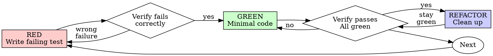

# Test-Driven Development (TDD)

## Overview

Write the test first. Watch it fail. Write minimal code to pass.

**Core principle:** If you didn't watch the test fail, you don't know if it tests the right thing.

**The spirit matters more than the letter. Here's why:** TDD exists to give you confidence that your code works. The ritual (red-green-refactor) serves that goal. When circumstances make the ritual costly, understand *why* the ritual exists so you can make informed tradeoffs.

## When to Use

**Strong candidates for TDD:**
- New features
- Bug fixes
- Refactoring
- Behavior changes

**Cases where TDD may not apply (document your reasoning):**
- Throwaway prototypes (if truly throwaway)
- Generated code (if generation is trusted)
- Configuration files
- Exploratory spikes (with commitment to rewrite)

## The Iron Principle

```
NO PRODUCTION CODE WITHOUT A FAILING TEST FIRST
```

This is the default. It produces the best outcomes in the vast majority of cases.

### Documented Failure Modes

The Iron Principle fails when:

1. **Exploration mode**: You don't yet know what API you want. The fix: explore, then throw away exploration and start TDD fresh.

2. **External system constraints**: You're debugging production with no local reproduction. The fix: write the test as soon as reproduction is possible.

3. **Time-critical hotfix**: Production is on fire. The fix: patch first, add test immediately after (within the same session), document the exception.

### When Code Exists Before Tests

**Options:**

1. **Delete and restart with TDD** - Highest confidence. Recommended when:
   - Code is < 1 hour of work
   - Requirements are now clearer than when you started
   - The implementation revealed design problems

2. **Proceed with documented risk** - Acceptable when:
   - Code is substantial (multiple hours)
   - You can verify behavior through integration tests
   - You document: "Tests written after implementation. Lower confidence in edge case coverage."

**Why deletion is often worth it:** Code written test-first tends to have better APIs because the test forces you to think as a *user* of the code before you think as an *implementer*.

## Red-Green-Refactor



### RED - Write Failing Test

Write one minimal test showing what should happen.

<Good>
```typescript
test('retries failed operations 3 times', async () => {
  let attempts = 0;
  const operation = () => {
    attempts++;
    if (attempts < 3) throw new Error('fail');
    return 'success';
  };

  const result = await retryOperation(operation);

  expect(result).toBe('success');
  expect(attempts).toBe(3);
});
```
Clear name, tests real behavior, one thing
</Good>

<Bad>
```typescript
test('retry works', async () => {
  const mock = jest.fn()
    .mockRejectedValueOnce(new Error())
    .mockRejectedValueOnce(new Error())
    .mockResolvedValueOnce('success');
  await retryOperation(mock);
  expect(mock).toHaveBeenCalledTimes(3);
});
```
Vague name, tests mock not code
</Bad>

**Requirements:**
- One behavior
- Clear name
- Real code (no mocks unless unavoidable)

### Verify RED - Watch It Fail

This step is important. Skipping it is a common source of false confidence.

```bash
npm test path/to/test.test.ts
```

Confirm:
- Test fails (not errors)
- Failure message is expected
- Fails because feature missing (not typos)

**Test passes?** You're testing existing behavior. Fix test.

**Test errors?** Fix error, re-run until it fails correctly.

### GREEN - Minimal Code

Write simplest code to pass the test.

<Good>
```typescript
async function retryOperation<T>(fn: () => Promise<T>): Promise<T> {
  for (let i = 0; i < 3; i++) {
    try {
      return await fn();
    } catch (e) {
      if (i === 2) throw e;
    }
  }
  throw new Error('unreachable');
}
```
Just enough to pass
</Good>

<Bad>
```typescript
async function retryOperation<T>(
  fn: () => Promise<T>,
  options?: {
    maxRetries?: number;
    backoff?: 'linear' | 'exponential';
    onRetry?: (attempt: number) => void;
  }
): Promise<T> {
  // YAGNI
}
```
Over-engineered
</Bad>

Don't add features, refactor other code, or "improve" beyond the test.

### Verify GREEN - Watch It Pass

```bash
npm test path/to/test.test.ts
```

Confirm:
- Test passes
- Other tests still pass
- Output pristine (no errors, warnings)

**Test fails?** Fix code, not test.

**Other tests fail?** Fix now.

### REFACTOR - Clean Up

After green only:
- Remove duplication
- Improve names
- Extract helpers

Keep tests green. Don't add behavior.

### Repeat

Next failing test for next feature.

## Good Tests

| Quality | Good | Bad |
|---------|------|-----|
| **Minimal** | One thing. "and" in name? Split it. | `test('validates email and domain and whitespace')` |
| **Clear** | Name describes behavior | `test('test1')` |
| **Shows intent** | Demonstrates desired API | Obscures what code should do |

## COSTS OF SKIPPING TDD

Real bugs that happen when you skip test-first development:

### Off-by-One Errors
**Scenario:** You implement pagination. Tests written after pass because you tested what you built.
**What TDD would have caught:** Writing `test('page 2 starts at item 11')` first forces you to think about boundaries. Tests-after tend to test `page 1` and assume the rest works.
**Cost:** Users see duplicate items, skip items, or get empty pages.

### Missing Edge Cases
**Scenario:** Email validation "works" in manual testing.
**What TDD would have caught:** Writing tests first prompts: "What about empty string? Whitespace only? Unicode? Plus signs?"
**Cost:** Invalid emails in database, bounce reports, reputation damage.

### Untested Error Paths
**Scenario:** You test the happy path. Error handling exists but was never exercised.
**What TDD would have caught:** `test('returns error when API times out')` forces you to implement and verify error handling.
**Cost:** Unhandled exceptions in production. Cryptic error messages. Data corruption.

### Regression Introduction
**Scenario:** You refactor "safely" because all tests pass.
**What TDD would have caught:** Tests written first define behavior independent of implementation. Tests written after often test implementation details.
**Cost:** "All tests pass" but production breaks because tests tested *how* not *what*.

### API Usability Problems
**Scenario:** Your function requires 6 parameters in a specific order.
**What TDD would have caught:** Writing the test first, you'd feel the pain of using your own API and design something better.
**Cost:** Every caller has to look up parameter order. Bugs from misorderd arguments.

### Concurrency Bugs
**Scenario:** Code works in single-threaded manual testing.
**What TDD would have caught:** `test('handles concurrent calls safely')` - though admittedly hard to test, the act of writing the test makes you think about the problem.
**Cost:** Race conditions that only appear under load.

## Why Order Matters

**"I'll write tests after to verify it works"**

Tests written after code pass immediately. Passing immediately proves nothing:
- Might test wrong thing
- Might test implementation, not behavior
- Might miss edge cases you forgot
- You never saw it catch the bug

Test-first forces you to see the test fail, proving it actually tests something.

**"I already manually tested all the edge cases"**

Manual testing is ad-hoc. You think you tested everything but:
- No record of what you tested
- Can't re-run when code changes
- Easy to forget cases under pressure
- "It worked when I tried it" != comprehensive

Automated tests are systematic. They run the same way every time.

**"Deleting X hours of work feels wasteful"**

The time is already gone. Your choice now:
- Delete and rewrite with TDD (X more hours, high confidence)
- Keep it and add tests after (30 min, low confidence, likely bugs)

The "waste" is keeping code you can't trust. Working code without real tests is technical debt.

**"TDD is dogmatic, being pragmatic means adapting"**

TDD IS pragmatic:
- Finds bugs before commit (faster than debugging after)
- Prevents regressions (tests catch breaks immediately)
- Documents behavior (tests show how to use code)
- Enables refactoring (change freely, tests catch breaks)

"Pragmatic" shortcuts = debugging in production = slower.

**"Tests after achieve the same goals - it's spirit not ritual"**

There's truth here. And also a trap.

Tests-after answer "What does this do?" Tests-first answer "What should this do?"

Tests-after are biased by your implementation. You test what you built, not what's required. You verify remembered edge cases, not discovered ones.

If you're skilled enough to recognize this bias and compensate for it, tests-after can work. But it requires more discipline, not less.

## Patterns That Historically Fail

These rationalizations have historically led to bugs. Recognize when you're reaching for them:

| Pattern | Historical Outcome |
|---------|-------------------|
| "Too simple to test" | Simple code breaks. Untested simple code breaks silently. |
| "I'll test after" | Tests passing immediately prove nothing. Edge cases missed. |
| "Tests after achieve same goals" | You test what you built, not what's required. |
| "Already manually tested" | Ad-hoc != systematic. No record, can't re-run. |
| "Deleting X hours is wasteful" | Sunk cost fallacy. Keeping unverified code is technical debt. |
| "Keep as reference, write tests first" | You'll adapt it. That's testing after with extra steps. |
| "Need to explore first" | Fine. The trap: keeping exploration as "done." |
| "Test hard = I'm not skilled enough" | Listen to test. Hard to test = hard to use. |
| "TDD will slow me down" | Short-term true. Long-term, debugging is slower. |
| "Manual test faster" | Manual doesn't prove edge cases. You'll re-test every change. |
| "Existing code has no tests" | You're improving it. Start the test coverage now. |

**Note:** Recognizing these patterns in yourself is a skill. The goal isn't shame—it's awareness.

## Decision Points

When you find yourself at these decision points, slow down and think:

| Situation | Questions to Ask |
|-----------|------------------|
| Code before test | How much code? What's the rewrite cost vs. risk of bugs? |
| Test passes immediately | Did I actually test new behavior, or existing behavior? |
| Can't explain why test failed | Do I understand what I'm testing? |
| Tests added "later" | Will "later" actually happen? (Track record?) |
| "This is different because..." | Is it actually different, or am I rationalizing? |
| "Already spent X hours" | Would I make the same choice if I were starting fresh? |

## Example: Bug Fix

**Bug:** Empty email accepted

**RED**
```typescript
test('rejects empty email', async () => {
  const result = await submitForm({ email: '' });
  expect(result.error).toBe('Email required');
});
```

**Verify RED**
```bash
$ npm test
FAIL: expected 'Email required', got undefined
```

**GREEN**
```typescript
function submitForm(data: FormData) {
  if (!data.email?.trim()) {
    return { error: 'Email required' };
  }
  // ...
}
```

**Verify GREEN**
```bash
$ npm test
PASS
```

**REFACTOR**
Extract validation for multiple fields if needed.

## Verification Checklist

Before marking work complete:

- [ ] Every new function/method has a test
- [ ] Watched each test fail before implementing (or documented exception)
- [ ] Each test failed for expected reason (feature missing, not typo)
- [ ] Wrote minimal code to pass each test
- [ ] All tests pass
- [ ] Output pristine (no errors, warnings)
- [ ] Tests use real code (mocks only if unavoidable)
- [ ] Edge cases and errors covered

**If you can't check all boxes:** Decide whether to restart with TDD or proceed with documented risk. Either choice is valid if you make it consciously.

## When Stuck

| Problem | Solution |
|---------|----------|
| Don't know how to test | Write wished-for API. Write assertion first. Ask your human partner. |
| Test too complicated | Design too complicated. Simplify interface. |
| Must mock everything | Code too coupled. Use dependency injection. |
| Test setup huge | Extract helpers. Still complex? Simplify design. |

## Debugging Integration

Bug found? Write failing test reproducing it. Follow TDD cycle. Test proves fix and prevents regression.

Fixing bugs without tests is possible but leaves you vulnerable to the same bug recurring.

## Testing Anti-Patterns

When adding mocks or test utilities, be aware of common pitfalls:
- Testing mock behavior instead of real behavior
- Adding test-only methods to production classes
- Mocking without understanding dependencies

## Summary

```
Production code -> test exists and failed first
Otherwise -> understand the cost, make a conscious choice
```

TDD is a practice that works. The discipline comes from understanding *why* it works, not from following rules blindly. When you choose to deviate, do so with full awareness of the tradeoffs.
