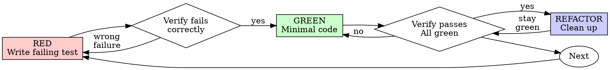

# Test-Driven Development (TDD)

## Overview

Write the test first. Watch it fail. Write minimal code to pass.

**Core principle:** If you didn't watch the test fail, you don't know if it tests the right thing.

**The spirit matters more than the letter. Here's why:** TDD's value comes from the feedback loop — seeing a test fail proves it tests something real. Any shortcut that bypasses this loop (writing code first, keeping "reference" implementations, adapting existing code) breaks the proof chain. The letter exists to protect the spirit.

## When to Use

**Always strongly recommended for:**
- New features
- Bug fixes
- Refactoring
- Behavior changes

**Exceptions (ask your human partner):**
- Throwaway prototypes
- Generated code
- Configuration files

Thinking "skip TDD just this once"? That's a common rationalization — it feels pragmatic but typically costs more time in debugging later.

## The Iron Principle

```
NO PRODUCTION CODE WITHOUT A FAILING TEST FIRST
```

**What happens when this is violated:** Code written before tests can't be verified — you never saw the test catch the bug, so you don't know if it actually tests the right thing. Tests written after tend to test the implementation (what you built) rather than the requirement (what should exist).

Write code before the test? Options: delete and restart with TDD (recommended — high confidence result), or proceed with documented risk that your tests may be testing implementation rather than behavior.

**Why restarting is recommended:**
- Keeping code as "reference" leads to adapting tests to match code, not requirements
- "Adapting" existing code while writing tests bypasses the fail-first proof
- Looking at existing code biases your test design toward what exists, not what's needed
- Starting fresh from tests takes less time than you expect

## Red-Green-Refactor


```dot
digraph tdd_cycle {
    rankdir=LR;
    red [label="RED\nWrite failing test", shape=box, style=filled, fillcolor="#ffcccc"];
    verify_red [label="Verify fails\ncorrectly", shape=diamond];
    green [label="GREEN\nMinimal code", shape=box, style=filled, fillcolor="#ccffcc"];
    verify_green [label="Verify passes\nAll green", shape=diamond];
    refactor [label="REFACTOR\nClean up", shape=box, style=filled, fillcolor="#ccccff"];
    next [label="Next", shape=ellipse];

    red -> verify_red;
    verify_red -> green [label="yes"];
    verify_red -> red [label="wrong\nfailure"];
    green -> verify_green;
    verify_green -> refactor [label="yes"];
    verify_green -> green [label="no"];
    refactor -> verify_green [label="stay\ngreen"];
    verify_green -> next;
    next -> red;
}
```

### RED - Write Failing Test

Write one minimal test showing what should happen.

<Good>
```typescript
test('retries failed operations 3 times', async () => {
  let attempts = 0;
  const operation = () => {
    attempts++;
    if (attempts < 3) throw new Error('fail');
    return 'success';
  };

  const result = await retryOperation(operation);

  expect(result).toBe('success');
  expect(attempts).toBe(3);
});
```
Clear name, tests real behavior, one thing
</Good>

<Bad>
```typescript
test('retry works', async () => {
  const mock = jest.fn()
    .mockRejectedValueOnce(new Error())
    .mockRejectedValueOnce(new Error())
    .mockResolvedValueOnce('success');
  await retryOperation(mock);
  expect(mock).toHaveBeenCalledTimes(3);
});
```
Vague name, tests mock not code
</Bad>

**Requirements:**
- One behavior
- Clear name
- Real code (no mocks unless unavoidable)

### Verify RED - Watch It Fail

**Critical step — skipping this removes the proof that your test works.** Without seeing the failure, a passing test could be testing nothing.

```bash
npm test path/to/test.test.ts
```

Confirm:
- Test fails (not errors)
- Failure message is expected
- Fails because feature missing (not typos)

**Test passes?** You're testing existing behavior. Fix test.

**Test errors?** Fix error, re-run until it fails correctly.

### GREEN - Minimal Code

Write simplest code to pass the test.

<Good>
```typescript
async function retryOperation<T>(fn: () => Promise<T>): Promise<T> {
  for (let i = 0; i < 3; i++) {
    try {
      return await fn();
    } catch (e) {
      if (i === 2) throw e;
    }
  }
  throw new Error('unreachable');
}
```
Just enough to pass
</Good>

<Bad>
```typescript
async function retryOperation<T>(
  fn: () => Promise<T>,
  options?: {
    maxRetries?: number;
    backoff?: 'linear' | 'exponential';
    onRetry?: (attempt: number) => void;
  }
): Promise<T> {
  // YAGNI
}
```
Over-engineered
</Bad>

Don't add features, refactor other code, or "improve" beyond the test.

### Verify GREEN - Watch It Pass

**Critical step.**

```bash
npm test path/to/test.test.ts
```

Confirm:
- Test passes
- Other tests still pass
- Output pristine (no errors, warnings)

**Test fails?** Fix code, not test.

**Other tests fail?** Fix now.

### REFACTOR - Clean Up

After green only:
- Remove duplication
- Improve names
- Extract helpers

Keep tests green. Don't add behavior.

### Repeat

Next failing test for next feature.

## Good Tests

| Quality | Good | Bad |
|---------|------|-----|
| **Minimal** | One thing. "and" in name? Split it. | `test('validates email and domain and whitespace')` |
| **Clear** | Name describes behavior | `test('test1')` |
| **Shows intent** | Demonstrates desired API | Obscures what code should do |

## Why Order Matters

**"I'll write tests after to verify it works"**

Tests written after code pass immediately. Passing immediately proves nothing:
- Might test wrong thing
- Might test implementation, not behavior
- Might miss edge cases you forgot
- You never saw it catch the bug

Test-first forces you to see the test fail, proving it actually tests something.

**"I already manually tested all the edge cases"**

Manual testing is ad-hoc. You think you tested everything but:
- No record of what you tested
- Can't re-run when code changes
- Easy to forget cases under pressure
- "It worked when I tried it" does not equal comprehensive

Automated tests are systematic. They run the same way every time.

**"Deleting X hours of work is wasteful"**

Sunk cost fallacy. The time is already gone. Your choice now:
- Delete and rewrite with TDD (X more hours, high confidence)
- Keep it and add tests after (30 min, low confidence, likely bugs)

The "waste" is keeping code you can't trust. Working code without real tests is technical debt.

**"TDD is dogmatic, being pragmatic means adapting"**

TDD IS pragmatic:
- Finds bugs before commit (faster than debugging after)
- Prevents regressions (tests catch breaks immediately)
- Documents behavior (tests show how to use code)
- Enables refactoring (change freely, tests catch breaks)

"Pragmatic" shortcuts = debugging in production = slower.

**"Tests after achieve the same goals - it's spirit not ritual"**

No. Tests-after answer "What does this do?" Tests-first answer "What should this do?"

Tests-after are biased by your implementation. You test what you built, not what's required. You verify remembered edge cases, not discovered ones.

Tests-first force edge case discovery before implementing. Tests-after verify you remembered everything (you didn't).

30 minutes of tests after does not equal TDD. You get coverage, lose proof tests work.

## Common Rationalization Patterns

These are tempting shortcuts that feel reasonable but undermine TDD's value. Here's why each one fails:

| Shortcut | Why it fails |
|----------|-------------|
| "Too simple to test" | Simple code breaks. Test takes 30 seconds. The cost of not testing is debugging later. |
| "I'll test after" | Tests passing immediately prove nothing — you never saw the failure. |
| "Tests after achieve same goals" | Tests-after = "what does this do?" Tests-first = "what should this do?" Different questions. |
| "Already manually tested" | Ad-hoc testing leaves no record, can't re-run, misses edge cases under pressure. |
| "Deleting X hours is wasteful" | Sunk cost fallacy. Keeping unverified code is technical debt that compounds. |
| "Keep as reference, write tests first" | You'll adapt tests to match the code. That's testing-after with extra steps. |
| "Need to explore first" | Fine. Throw away exploration, then start with TDD. Exploration is learning, not implementation. |
| "Test hard = design unclear" | Listen to what the test is telling you. Hard to test = hard to use. Simplify the interface. |
| "TDD will slow me down" | TDD is faster than debugging. The slowdown is an illusion from front-loading work. |
| "Manual test faster" | Manual doesn't prove edge cases. You'll re-test every change manually too. |
| "Existing code has no tests" | You're improving it. Add tests for the code you're changing. |

## Red Flags — Pause and Reconsider

If you notice these patterns, it's worth stopping to check whether TDD is being followed:

- Code written before test
- Test written after implementation
- Test passes immediately without failing first
- Can't explain why test failed
- Tests deferred to "later"
- Rationalizing "just this once"
- "I already manually tested it"
- "Tests after achieve the same purpose"
- "It's about spirit not ritual"
- "Keep as reference" or "adapt existing code"
- "Already spent X hours, deleting is wasteful"
- "TDD is dogmatic, I'm being pragmatic"
- "This is different because..."

**These typically indicate the TDD cycle has been broken.** The recommended path: set aside the existing code and restart with test-first. The cost of restarting is almost always less than the cost of debugging untested code.

## Example: Bug Fix

**Bug:** Empty email accepted

**RED**
```typescript
test('rejects empty email', async () => {
  const result = await submitForm({ email: '' });
  expect(result.error).toBe('Email required');
});
```

**Verify RED**
```bash
$ npm test
FAIL: expected 'Email required', got undefined
```

**GREEN**
```typescript
function submitForm(data: FormData) {
  if (!data.email?.trim()) {
    return { error: 'Email required' };
  }
  // ...
}
```

**Verify GREEN**
```bash
$ npm test
PASS
```

**REFACTOR**
Extract validation for multiple fields if needed.

## Verification Checklist

Before marking work complete:

- [ ] Every new function/method has a test
- [ ] Watched each test fail before implementing
- [ ] Each test failed for expected reason (feature missing, not typo)
- [ ] Wrote minimal code to pass each test
- [ ] All tests pass
- [ ] Output pristine (no errors, warnings)
- [ ] Tests use real code (mocks only if unavoidable)
- [ ] Edge cases and errors covered

Can't check all boxes? The TDD cycle was likely incomplete. Consider going back to fill the gaps.

## When Stuck

| Problem | Solution |
|---------|----------|
| Don't know how to test | Write wished-for API. Write assertion first. Ask your human partner. |
| Test too complicated | Design too complicated. Simplify interface. |
| Must mock everything | Code too coupled. Use dependency injection. |
| Test setup huge | Extract helpers. Still complex? Simplify design. |

## Debugging Integration

Bug found? Write failing test reproducing it. Follow TDD cycle. Test proves fix and prevents regression.

Avoid fixing bugs without a test — the consequence is that you can't prove the fix works or prevent regression.

## Testing Anti-Patterns

When adding mocks or test utilities, read @testing-anti-patterns.md to avoid common pitfalls:
- Testing mock behavior instead of real behavior
- Adding test-only methods to production classes
- Mocking without understanding dependencies

## Final Principle

```
Production code → test exists and failed first
Otherwise → not TDD
```

Exceptions should involve your human partner's input — they have context you may not.
