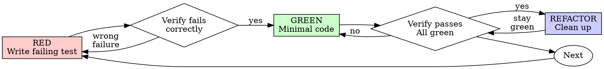

# Test-Driven Development (TDD)

## Overview

Write the test first. Watch it fail. Write minimal code to pass.

**Core principle:** Seeing the test fail proves it tests something real. Skipping this trades certainty for speed.

## Parameters (caller controls)

| Parameter | Default | Range | Description |
|-----------|---------|-------|-------------|
| `strictness` | standard | minimal, standard, strict | How rigidly to follow TDD. minimal=test after if needed, standard=test first (Iron Principle), strict=no production code without failing test, no exceptions |
| `coverage_target` | none | none, lines, branches, mutations | What coverage metric to enforce. none=no coverage gate, lines=line coverage %, branches=branch coverage %, mutations=mutation testing |
| `test_style` | auto | auto, unit, integration, e2e, property | Preferred test type. auto=choose based on code being tested (current behavior) |

Parse from caller prompt. "Quick prototype, skip TDD" -> strictness=minimal. "Full TDD, no shortcuts" -> strictness=strict. "Aim for branch coverage" -> coverage_target=branches. "Property-based tests" -> test_style=property.

## When to Use

**Strongly recommended for:**
- New features
- Bug fixes
- Refactoring
- Behavior changes

**Reasonable to skip (check with your human partner):**
- Throwaway prototypes
- Generated code
- Configuration files

## The Iron Principle

```
NO PRODUCTION CODE WITHOUT A FAILING TEST FIRST
```

**What this buys you:** Tests written before code verify *requirements*. Tests written after code verify *implementation* — you test what you built, not what should exist.

Wrote code before the test? Options: delete and restart with TDD (recommended), or proceed knowing your tests may be testing implementation rather than behavior.

**Adapts to `strictness` parameter:**
- `strictness=minimal`: Production code first is acceptable. Write tests after to verify behavior. The tradeoff: tests may verify implementation, not requirements.
- `strictness=standard`: Current text above applies — test first is the expected path.
- `strictness=strict`: Every production line requires a pre-existing failing test. Prototypes, generated code, config files -- all get tests first. The cost of skipping: untested code breeds untested assumptions.

## Red-Green-Refactor


```dot
digraph tdd_cycle {
    rankdir=LR;
    red [label="RED\nWrite failing test", shape=box, style=filled, fillcolor="#ffcccc"];
    verify_red [label="Verify fails\ncorrectly", shape=diamond];
    green [label="GREEN\nMinimal code", shape=box, style=filled, fillcolor="#ccffcc"];
    verify_green [label="Verify passes\nAll green", shape=diamond];
    refactor [label="REFACTOR\nClean up", shape=box, style=filled, fillcolor="#ccccff"];
    next [label="Next", shape=ellipse];

    red -> verify_red;
    verify_red -> green [label="yes"];
    verify_red -> red [label="wrong\nfailure"];
    green -> verify_green;
    verify_green -> refactor [label="yes"];
    verify_green -> green [label="no"];
    refactor -> verify_green [label="stay\ngreen"];
    verify_green -> next;
    next -> red;
}
```

### RED - Write Failing Test

Write one minimal test showing what should happen.

<Good>
```typescript
test('retries failed operations 3 times', async () => {
  let attempts = 0;
  const operation = () => {
    attempts++;
    if (attempts < 3) throw new Error('fail');
    return 'success';
  };

  const result = await retryOperation(operation);

  expect(result).toBe('success');
  expect(attempts).toBe(3);
});
```
Clear name, tests real behavior, one thing
</Good>

<Bad>
```typescript
test('retry works', async () => {
  const mock = jest.fn()
    .mockRejectedValueOnce(new Error())
    .mockRejectedValueOnce(new Error())
    .mockResolvedValueOnce('success');
  await retryOperation(mock);
  expect(mock).toHaveBeenCalledTimes(3);
});
```
Vague name, tests mock not code
</Bad>

**Requirements:**
- One behavior
- Clear name
- Real code (no mocks unless unavoidable)

### Verify RED - Watch It Fail

Run the test. Confirm it fails for the right reason (feature missing, not a typo or import error). Without seeing the failure, a passing test could be testing nothing.

```bash
npm test path/to/test.test.ts
```

**Test passes?** You're testing existing behavior. Fix test.

**Test errors?** Fix error, re-run until it fails correctly.

### GREEN - Minimal Code

Write simplest code to pass the test.

<Good>
```typescript
async function retryOperation<T>(fn: () => Promise<T>): Promise<T> {
  for (let i = 0; i < 3; i++) {
    try {
      return await fn();
    } catch (e) {
      if (i === 2) throw e;
    }
  }
  throw new Error('unreachable');
}
```
Just enough to pass
</Good>

<Bad>
```typescript
async function retryOperation<T>(
  fn: () => Promise<T>,
  options?: {
    maxRetries?: number;
    backoff?: 'linear' | 'exponential';
    onRetry?: (attempt: number) => void;
  }
): Promise<T> {
  // YAGNI
}
```
Over-engineered
</Bad>

Don't add features, refactor other code, or "improve" beyond the test.

### Verify GREEN - Watch It Pass

```bash
npm test path/to/test.test.ts
```

Confirm:
- Test passes
- Other tests still pass
- Output clean (no errors, warnings)

**Test fails?** Fix code, not test.

**Other tests fail?** Fix now.

### REFACTOR - Clean Up

After green only:
- Remove duplication
- Improve names
- Extract helpers

Keep tests green. Don't add behavior.

### Repeat

Next failing test for next feature.

**When `strictness=minimal`:** The cycle becomes GREEN (write code) -> TEST (add tests) -> REFACTOR. You lose the RED verification that tests catch real failures. Proceed knowingly.

## Good Tests

| Quality | Good | Bad |
|---------|------|-----|
| **Minimal** | One thing. "and" in name? Split it. | `test('validates email and domain and whitespace')` |
| **Clear** | Name describes behavior | `test('test1')` |
| **Shows intent** | Demonstrates desired API | Obscures what code should do |

**Adapts to `test_style` parameter:**
- `test_style=property`: Define invariants rather than specific input/output pairs. Use the testing framework's property-based testing support (e.g., fast-check, hypothesis). Example: "for all valid emails, submitForm returns no error."
- `test_style=e2e`: Test complete user journeys. Accept longer setup and execution time. One test covers the full flow rather than isolated units.
- `test_style=integration`: Test interactions between components. More setup than unit, narrower scope than e2e.
- `test_style=unit`: Test isolated functions/methods. Mock dependencies at the boundary.
- `test_style=auto` (default): Choose based on what is being tested — unit for pure functions, integration for multi-component behavior, e2e for user-facing flows.

## Why Test-First vs Test-After

Tests written after code pass immediately — you never saw the failure, so you can't be sure the test catches anything. Test-first forces edge case discovery *before* implementing. Test-after verifies what you remembered to check (not the same thing).

## Shortcuts That Backfire

| Shortcut | Why it backfires |
|----------|-----------------|
| "Too simple to test" | Simple code breaks. Test takes 30 seconds. |
| "I'll test after" | Tests passing immediately don't prove they catch failures. |
| "Keep as reference, write tests first" | You'll adapt tests to match the code — that's test-after with extra steps. |
| "Need to explore first" | Fine — throw away exploration, then start with TDD. |
| "TDD will slow me down" | Front-loads work that would otherwise be spent debugging. |

## Example: Bug Fix

**Bug:** Empty email accepted

**RED**
```typescript
test('rejects empty email', async () => {
  const result = await submitForm({ email: '' });
  expect(result.error).toBe('Email required');
});
```

**Verify RED**
```bash
$ npm test
FAIL: expected 'Email required', got undefined
```

**GREEN**
```typescript
function submitForm(data: FormData) {
  if (!data.email?.trim()) {
    return { error: 'Email required' };
  }
  // ...
}
```

**Verify GREEN**
```bash
$ npm test
PASS
```

**REFACTOR**
Extract validation for multiple fields if needed.

## Verification Checklist

Before marking work complete:

- [ ] Every new function/method has a test
- [ ] Watched each test fail before implementing
- [ ] Each test failed for expected reason (feature missing, not typo)
- [ ] Wrote minimal code to pass each test
- [ ] All tests pass
- [ ] Output clean (no errors, warnings)
- [ ] Tests use real code (mocks only if unavoidable)
- [ ] Edge cases and errors covered
- [ ] When `coverage_target=lines`: Line coverage meets threshold
- [ ] When `coverage_target=branches`: Branch coverage meets threshold
- [ ] When `coverage_target=mutations`: Mutation testing score meets threshold

## When Stuck

| Problem | Solution |
|---------|----------|
| Don't know how to test | Write wished-for API. Write assertion first. Ask your human partner. |
| Test too complicated | Design too complicated. Simplify interface. |
| Must mock everything | Code too coupled. Use dependency injection. |
| Test setup huge | Extract helpers. Still complex? Simplify design. |

## Debugging Integration

Bug found? Write failing test reproducing it. Follow TDD cycle. The test proves the fix and prevents regression.

## Testing Anti-Patterns

When adding mocks or test utilities, read @testing-anti-patterns.md to avoid common pitfalls:
- Testing mock behavior instead of real behavior
- Adding test-only methods to production classes
- Mocking without understanding dependencies

## Final Principle

```
Production code → test exists and failed first
Otherwise → not TDD
```

Exceptions should involve your human partner's input — they have context you may not.
