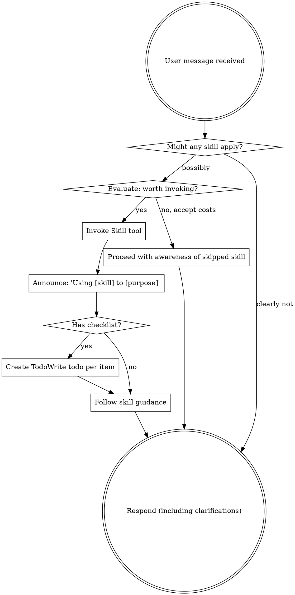

## Philosophy

**Agents have agency.** Skills are invitations with documented costs, not commands without escape.

You are a reasoning agent. You can evaluate whether a skill applies. You can weigh costs and benefits. You can make informed decisions. This skill helps you do that well.

## How to Access Skills

**In Claude Code:** Use the `Skill` tool. When you invoke a skill, its content is loaded and presented to you. Never use the Read tool on skill files.

**In other environments:** Check your platform's documentation for how skills are loaded.

---

# Using Skills Effectively

## The Recommendation

**Strongly recommended:** Invoke relevant or potentially-relevant skills before responding or acting.

**Why this matters:** Skills encode accumulated wisdom from past failures. They're not bureaucratic overhead—they're distilled experience about what goes wrong when you skip steps.

**Cost of skipping:** When you proceed without checking applicable skills, you risk:
- Repeating mistakes that the skill was designed to prevent
- Missing context that would change your approach
- Producing work that needs to be redone
- Burning tokens on approaches that don't fit the project's patterns

## Decision Framework

When deciding whether to invoke a skill:

| Factor | Weight Higher | Weight Lower |
|--------|---------------|--------------|
| Consequence of failure | High stakes, hard to undo | Low stakes, easily fixed |
| Complexity | Multi-step, many files | Single change, obvious |
| Familiarity | New domain, unfamiliar codebase | Well-known territory |
| User expectation | Formal deliverable | Quick exploration |
| Time sensitivity | Accuracy matters more than speed | Speed genuinely matters |

**Default recommendation:** When in doubt, invoke the skill. The cost of loading a skill is a few hundred tokens. The cost of redoing work is thousands.

## Common Rationalization Patterns

These thought patterns often precede mistakes. Watch for them:

| Thought | Why It Often Fails |
|---------|-------------------|
| "This is just a simple question" | Simple questions can have complex answers. Skills may reveal angles you'd miss. |
| "I need more context first" | Skills often define HOW to gather context. Gathering context without guidance can lead you down rabbit holes. |
| "Let me explore the codebase first" | Undirected exploration burns tokens. Skills focus your exploration. |
| "I can check git/files quickly" | Quick checks miss conversation context. Skills know what context matters. |
| "This doesn't need a formal skill" | Informality isn't virtue. Skills exist because informal approaches failed. |
| "I remember this skill" | Skills evolve. Your cached memory may be stale. Current version costs little to check. |
| "The skill is overkill" | "Overkill" often means "thorough." Simple things become complex. |
| "I'll just do this one thing first" | First actions set direction. Wrong direction costs more to correct later. |

**These aren't forbidden thoughts.** They're signals to pause and explicitly weigh the costs documented in the skill before proceeding.

## Skill Priority

When multiple skills could apply:

1. **Process skills first** (brainstorming, debugging) - these determine HOW to approach the task
2. **Implementation skills second** (frontend-design, mcp-builder) - these guide execution

"Let's build X" -> brainstorming first, then implementation skills.
"Fix this bug" -> debugging first, then domain-specific skills.

## Skill Types

**Rigid** (TDD, debugging): These skills encode sequences where order matters. Adapting them often reintroduces the problems they solved.

**Flexible** (patterns): These skills encode principles. Adapt to context while honoring the core insight.

The skill itself tells you which.

## User Instructions

User instructions say WHAT, not HOW. "Add X" or "Fix Y" doesn't specify workflow.

**Your judgment matters:** You decide whether a skill applies and how closely to follow it. But you should make that decision explicitly, not by default.

---

# COSTS OF SKIPPING

This section documents what actually goes wrong when skills are bypassed. It's here so you can make informed decisions.

## Skipping brainstorming skill

**What goes wrong:**
- Implementation starts before requirements are understood
- Edge cases discovered late, requiring rework
- User intent misread, producing the wrong thing correctly
- Solution doesn't fit the actual problem shape

**When skipping might be appropriate:**
- Requirements are fully specified and unambiguous
- You're implementing a pattern you've used successfully in this exact codebase
- User explicitly wants rapid iteration over careful planning

## Skipping debugging skill

**What goes wrong:**
- Fix addresses symptoms, not causes
- Debugging session spirals without systematic narrowing
- Root cause identified incorrectly, "fix" introduces new bugs
- Hours spent on what systematic approach would solve in minutes

**When skipping might be appropriate:**
- Error is self-explanatory (typo, missing import)
- You've seen this exact error in this exact context before
- Quick hypothesis is trivially testable

## Skipping verification skill

**What goes wrong:**
- Claim "it works" before confirming it works
- Tests pass locally, fail in CI
- Edge cases untested
- User discovers bugs that verification would have caught

**When skipping might be appropriate:**
- Change is purely additive and isolated
- Existing test suite is comprehensive and green
- User explicitly accepts lower verification bar

## Skipping code review skill

**What goes wrong:**
- Blind spots in your own code remain blind
- Code quality drifts without feedback loop
- Patterns that worked in other codebases don't fit here
- Technical debt accumulates invisibly

**When skipping might be appropriate:**
- Change is trivial and well-tested
- Time pressure genuinely exists and user accepts risk
- You'll revisit with review before merge

---

## The Meta-Point

Skills are tools for your judgment, not replacements for it. This skill exists to help you use them well.

When you skip a skill, you're not breaking a rule. You're accepting documented costs. Make that choice consciously.

When you follow a skill, you're not being obedient. You're leveraging accumulated wisdom. Do so thoughtfully.

**Your agency is the point. Exercise it well.**
