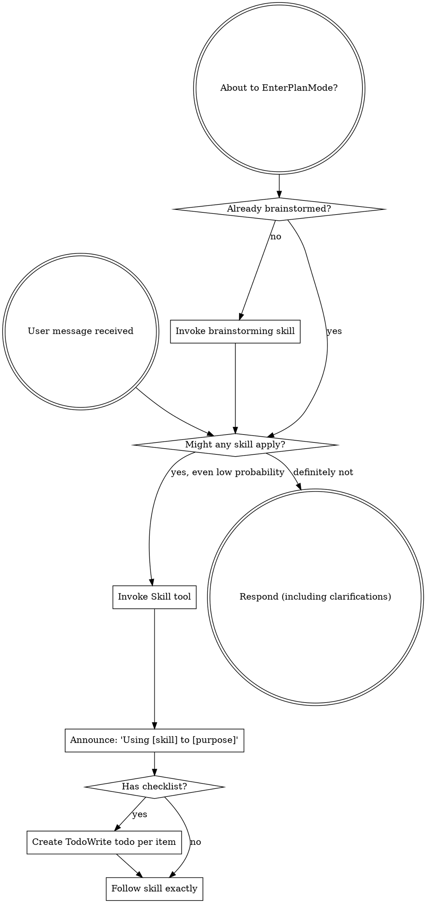

## How to Access Skills

**In Claude Code:** Use the `Skill` tool. When you invoke a skill, its content is loaded and presented to you—follow it directly. Avoid using the Read tool on skill files — the Skill tool is purpose-built for this and provides better context.

**In other environments:** Check your platform's documentation for how skills are loaded.

# Using Skills

## Why Skills Matter

Skills capture patterns that prevent common mistakes. The cost of checking whether a skill applies is low; the benefit when it does is high.

## The Principle

**Check for relevant skills BEFORE starting work.** If a skill might apply, load it — an irrelevant skill costs seconds, a missed one can cost hours.

```dot
digraph skill_flow {
    "User message received" [shape=doublecircle];
    "About to EnterPlanMode?" [shape=doublecircle];
    "Already brainstormed?" [shape=diamond];
    "Invoke brainstorming skill" [shape=box];
    "Might any skill apply?" [shape=diamond];
    "Invoke Skill tool" [shape=box];
    "Announce: 'Using [skill] to [purpose]'" [shape=box];
    "Has checklist?" [shape=diamond];
    "Create TodoWrite todo per item" [shape=box];
    "Follow skill exactly" [shape=box];
    "Respond (including clarifications)" [shape=doublecircle];

    "About to EnterPlanMode?" -> "Already brainstormed?";
    "Already brainstormed?" -> "Invoke brainstorming skill" [label="no"];
    "Already brainstormed?" -> "Might any skill apply?" [label="yes"];
    "Invoke brainstorming skill" -> "Might any skill apply?";

    "User message received" -> "Might any skill apply?";
    "Might any skill apply?" -> "Invoke Skill tool" [label="yes, even low probability"];
    "Might any skill apply?" -> "Respond (including clarifications)" [label="definitely not"];
    "Invoke Skill tool" -> "Announce: 'Using [skill] to [purpose]'";
    "Announce: 'Using [skill] to [purpose]'" -> "Has checklist?";
    "Has checklist?" -> "Create TodoWrite todo per item" [label="yes"];
    "Has checklist?" -> "Follow skill exactly" [label="no"];
    "Create TodoWrite todo per item" -> "Follow skill exactly";
}
```

## Skill Priority

When multiple skills could apply:

1. **Process skills first** (brainstorming, debugging) — these determine HOW to approach the task
2. **Implementation skills second** (frontend-design, mcp-builder) — these guide execution

"Let's build X" → brainstorming first, then implementation skills.
"Fix this bug" → debugging first, then domain-specific skills.

## Skill Types

**Rigid** (TDD, debugging): Follow closely. The structure is the value.

**Flexible** (patterns): Adapt principles to context.

The skill itself tells you which.

## User Instructions

Instructions say WHAT, not HOW. "Add X" or "Fix Y" doesn't mean skip workflows.
