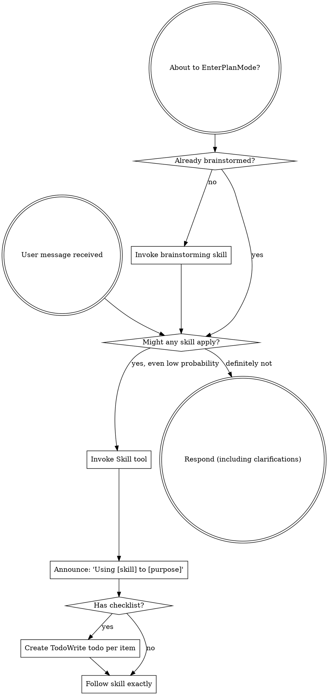

## How to Access Skills

**In Claude Code:** Use the `Skill` tool. When you invoke a skill, its content is loaded and presented to you—follow it directly. Avoid using the Read tool on skill files — the Skill tool is purpose-built for this and provides better context.

**In other environments:** Check your platform's documentation for how skills are loaded.

# Using Skills

## Why Skills Matter

Skills encode hard-won patterns and prevent repeated mistakes. Skipping a relevant skill risks slower work, missed edge cases, and reinventing solutions that already exist. Invoking a skill that turns out to be irrelevant costs very little — skipping one that was relevant can cost hours.

## The Principle

**Invoke relevant or requested skills BEFORE any response or action.** Even a low probability that a skill applies is worth checking — the cost of loading an irrelevant skill is tiny compared to missing a relevant one.

```dot
digraph skill_flow {
    "User message received" [shape=doublecircle];
    "About to EnterPlanMode?" [shape=doublecircle];
    "Already brainstormed?" [shape=diamond];
    "Invoke brainstorming skill" [shape=box];
    "Might any skill apply?" [shape=diamond];
    "Invoke Skill tool" [shape=box];
    "Announce: 'Using [skill] to [purpose]'" [shape=box];
    "Has checklist?" [shape=diamond];
    "Create TodoWrite todo per item" [shape=box];
    "Follow skill exactly" [shape=box];
    "Respond (including clarifications)" [shape=doublecircle];

    "About to EnterPlanMode?" -> "Already brainstormed?";
    "Already brainstormed?" -> "Invoke brainstorming skill" [label="no"];
    "Already brainstormed?" -> "Might any skill apply?" [label="yes"];
    "Invoke brainstorming skill" -> "Might any skill apply?";

    "User message received" -> "Might any skill apply?";
    "Might any skill apply?" -> "Invoke Skill tool" [label="yes, even low probability"];
    "Might any skill apply?" -> "Respond (including clarifications)" [label="definitely not"];
    "Invoke Skill tool" -> "Announce: 'Using [skill] to [purpose]'";
    "Announce: 'Using [skill] to [purpose]'" -> "Has checklist?";
    "Has checklist?" -> "Create TodoWrite todo per item" [label="yes"];
    "Has checklist?" -> "Follow skill exactly" [label="no"];
    "Create TodoWrite todo per item" -> "Follow skill exactly";
}
```

## Common Rationalization Patterns

These thoughts often lead to skipping skills. Watch for them — they feel productive but typically cost time:

| Thought | Why it's worth pausing |
|---------|----------------------|
| "This is just a simple question" | Questions are tasks. A quick skill check takes seconds. |
| "I need more context first" | Skill check comes before clarifying questions — skills often guide how to gather context. |
| "Let me explore the codebase first" | Skills tell you HOW to explore. Checking first saves false starts. |
| "I can check git/files quickly" | Files lack conversation context. Skills fill that gap. |
| "Let me gather information first" | Skills tell you HOW to gather information effectively. |
| "This doesn't need a formal skill" | If a skill exists, it likely saves time. Cost of checking is near zero. |
| "I remember this skill" | Skills evolve. Reading the current version prevents acting on outdated patterns. |
| "This doesn't count as a task" | Any action benefits from pattern-checking. |
| "The skill is overkill" | Simple things become complex. A skill check is cheap insurance. |
| "I'll just do this one thing first" | Checking before acting prevents rework. |
| "This feels productive" | Undisciplined action can waste time. Skills provide structure. |
| "I know what that means" | Knowing the concept and using the skill are different. The skill has specifics. |

## Skill Priority

When multiple skills could apply, use this order:

1. **Process skills first** (brainstorming, debugging) - these determine HOW to approach the task
2. **Implementation skills second** (frontend-design, mcp-builder) - these guide execution

"Let's build X" → brainstorming first, then implementation skills.
"Fix this bug" → debugging first, then domain-specific skills.

## Skill Types

**Rigid** (TDD, debugging): Follow exactly. Don't adapt away discipline.

**Flexible** (patterns): Adapt principles to context.

The skill itself tells you which.

## User Instructions

Instructions say WHAT, not HOW. "Add X" or "Fix Y" doesn't mean skip workflows.
